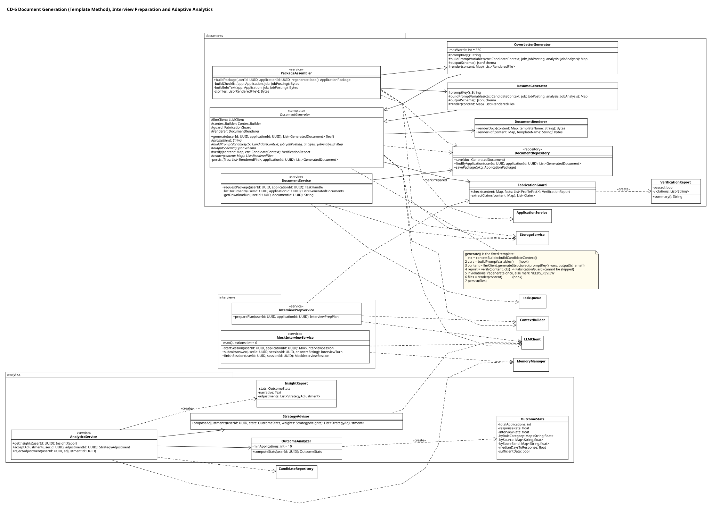
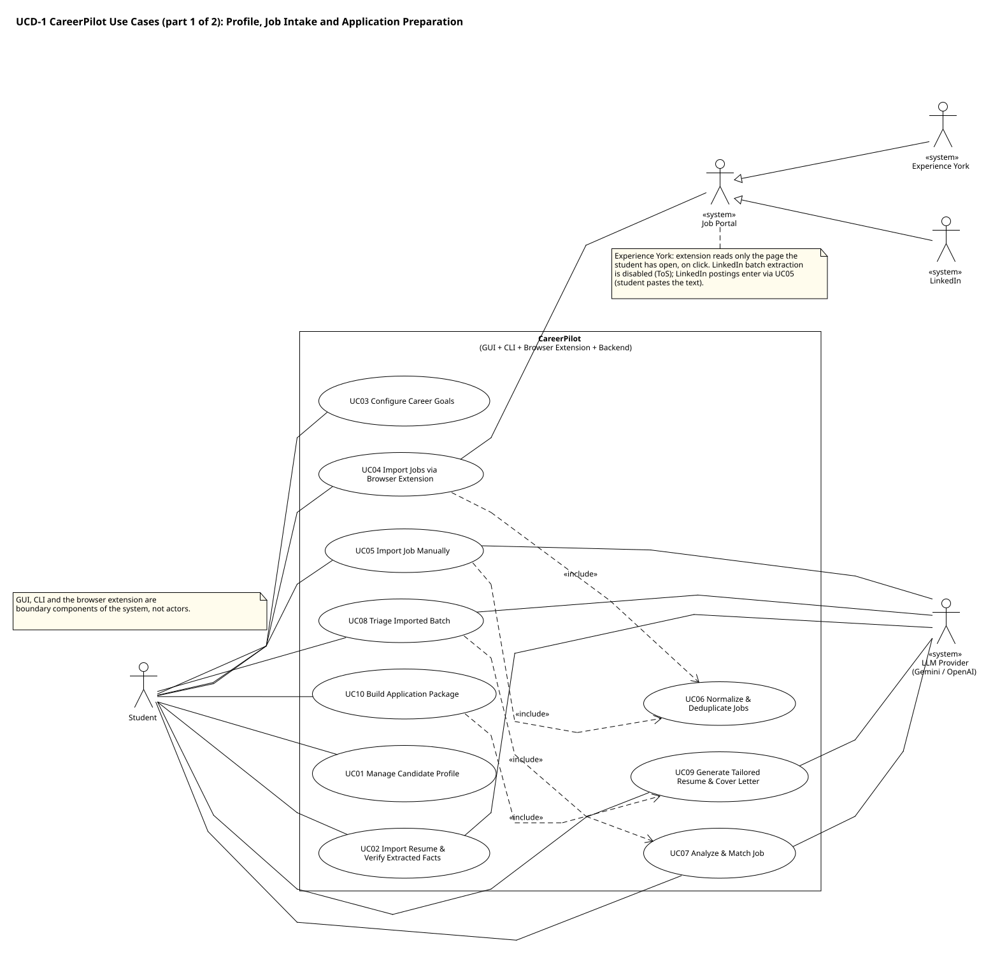
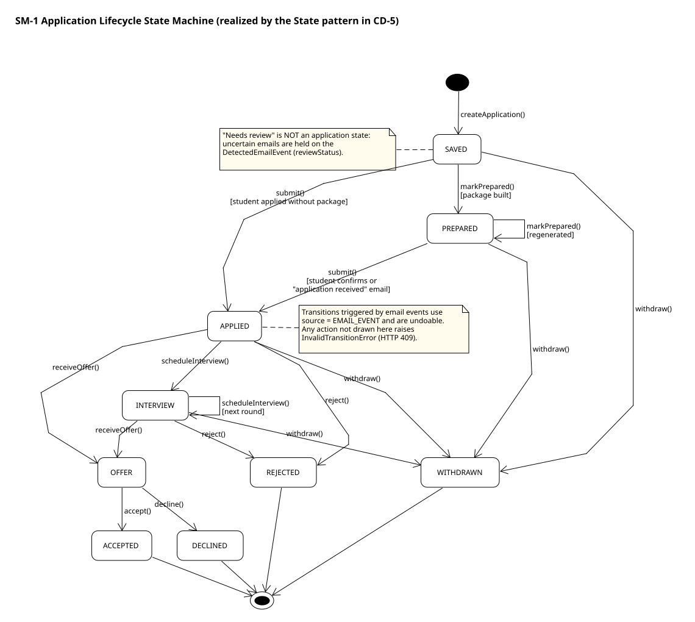
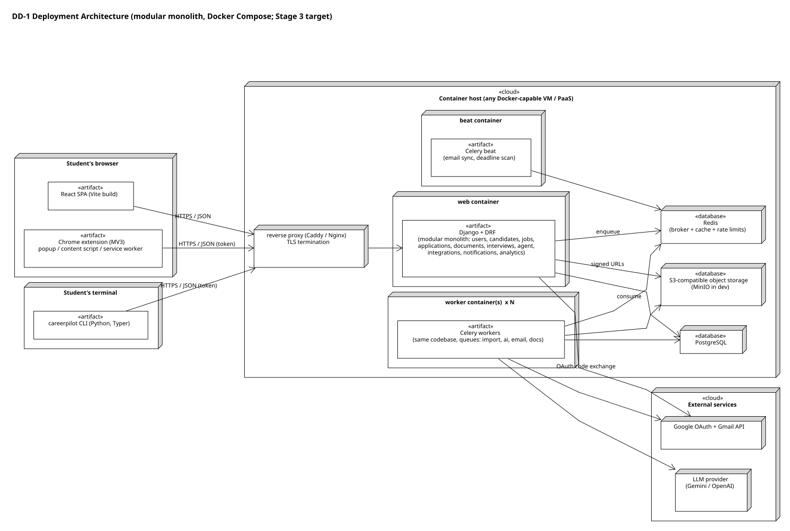
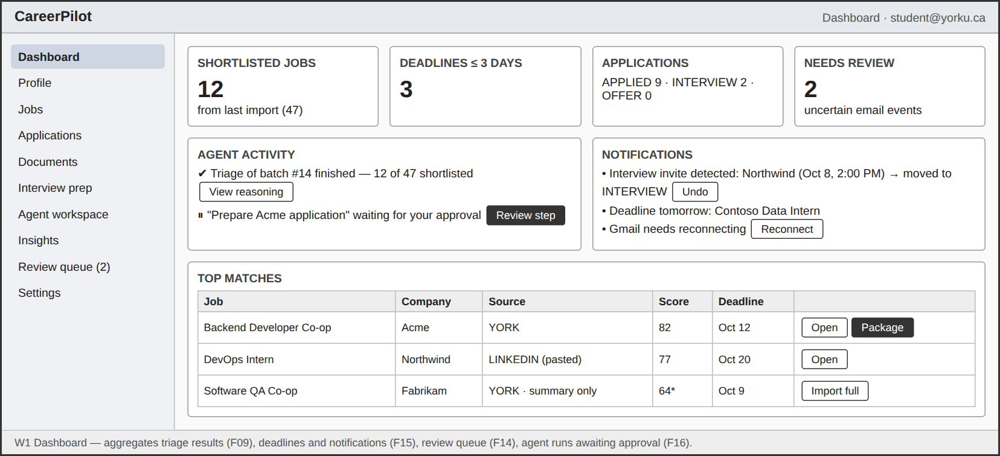
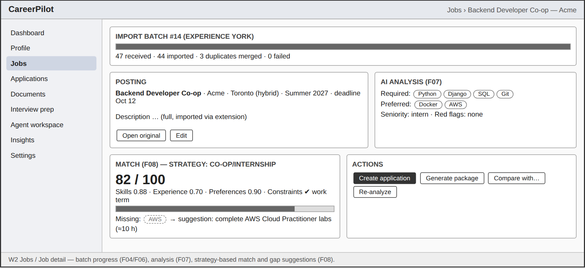
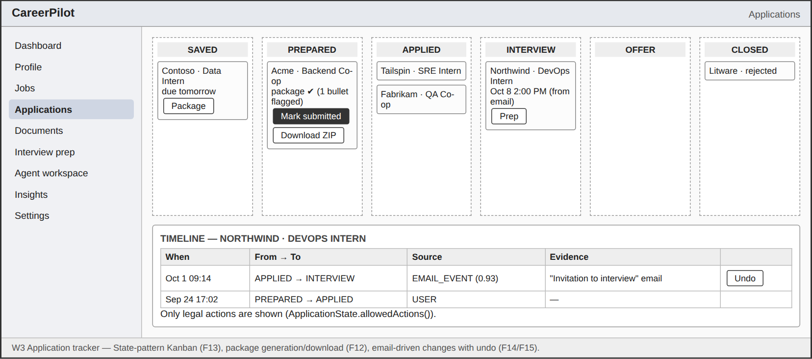
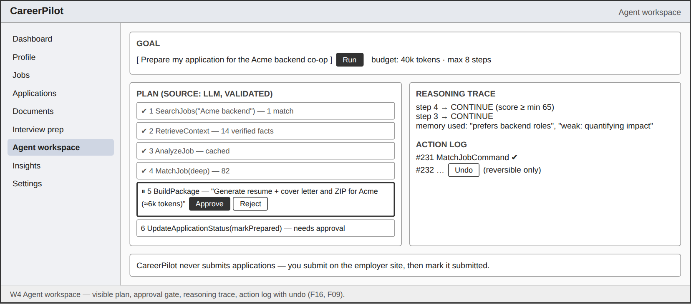
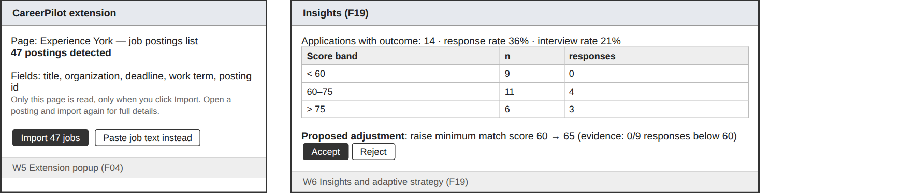

# CareerPilot — Stage 1 Project Design Report

| | |
|---|---|
| **Course** | EECS 3311 Software Design, Fall 2026, York University |
| **Deliverable** | Stage 1: Agent project definition, UML design, design patterns and feature-to-design traceability |
| **Repository** | `https://github.com/Parsa-Meshkini/CareerPilot` (public; used for Stages 1, 2 and 3) |
| **Team** | Parsa Meshkini |
| **Version** | 1.0 (Stage 1 submission) |

> **How to read this report.** Sections 1–3 define the project and its agent. Section 4 specifies the 19 features. Section 5 contains the UML design: class, use-case and sequence diagrams, plus justified supplementary diagrams. Sections 6–9 cover design patterns, use-case descriptions, the traceability matrix and per-feature implementation explanations, as required by Tasks 1–4 of the Stage 1 instructions. Sections 10–16 cover the GUI, the CLI, integrations, deployment, security, risks and the Stage 2/3 roadmaps. Every diagram is drawn in UMLet and has an editable `.uxf` source in `docs/uml/src/`. `tools/check_uml_consistency.py` automatically verifies that the class diagrams, sequence diagrams and traceability matrix are consistent (Section 8.2).

## Table of Contents

- [0. Stage 1 Architecture & Feasibility Audit (summary)](#0-stage-1-architecture-feasibility-audit-summary)
- [1. Project Overview](#1-project-overview)
- [2. System Overview](#2-system-overview)
- [3. AI / Agent Design](#3-ai-agent-design)
- [4. Feature Specifications](#4-feature-specifications)
- [5. UML Design](#5-uml-design)
- [6. Design Patterns](#6-design-patterns)
- [7. Use-Case Descriptions](#7-use-case-descriptions)
- [8. Feature-to-Design Traceability](#8-feature-to-design-traceability)
- [9. Feature Implementation Explanations](#9-feature-implementation-explanations)
- [10. GUI Design](#10-gui-design)
- [11. CLI Design](#11-cli-design)
- [12. Integration, Scalability and Deployment Architecture](#12-integration-scalability-and-deployment-architecture)
- [13. Security and Privacy](#13-security-and-privacy)
- [14. Risks and Limitations](#14-risks-and-limitations)
- [15. Stage 2 Implementation Roadmap](#15-stage-2-implementation-roadmap)
- [16. Stage 3 Testing and Deployment Roadmap](#16-stage-3-testing-and-deployment-roadmap)
- [Appendix A. Stage 1 Self-Review Checklist](#appendix-a-stage-1-self-review-checklist)
- [Appendix B. Repository Structure](#appendix-b-repository-structure)
- [Appendix C. Requirement-to-Section Map](#appendix-c-requirement-to-section-map)

---

# 0. Stage 1 Architecture & Feasibility Audit (summary)

Before designing anything, the team audited the original CareerPilot idea against the Stage 1 instructions, the UML lecture notes (EECS 3311 "UML" I and II), agent-system expectations, and realistic Stage 2/3 constraints. The full audit, with severities, is in `docs/requirements/stage1_audit.md`. The decisions it produced are summarized here because they shape the rest of the design.

| # | Finding | Severity | Resolution adopted in this design |
|---|---|---|---|
| A1 | LinkedIn's User Agreement and its "Prohibited software and extensions" policy forbid browser plug-ins and add-ons that scrape or copy LinkedIn data. Batch extraction from LinkedIn pages is therefore not acceptable. | Critical (fixed) | LinkedIn is an **integration slot, not a dependency**. Core scope: the student pastes a LinkedIn posting's text (`ManualJobImportAdapter`, F05). `LinkedInBrowserImportAdapter` / `LinkedInExtractor` exist in the design but are **disabled** until a ToS review or an official partner API allows them. |
| A2 | No public, documented Experience York job API is known. The portal requires York authentication, and its list pages generally show only posting summaries. | Critical (fixed) | The extension reads **only the page the student already has open, only when the student clicks**. It never crawls, paginates automatically, sends background requests, or handles York credentials. Batch-imported postings are stored with `completeness = SUMMARY` and are upgraded to `FULL` when the student opens a posting. Stage 2/3 tests and demos use a saved HTML fixture and `MockJobSourceAdapter`, so the project never depends on the live portal. |
| A3 | `gmail.readonly` is a Google **restricted** scope. Public production use requires OAuth verification and an annual third-party (CASA) security assessment. In Google's "Testing" publishing status, refresh tokens expire after about 7 days and the user count is capped. | Critical (fixed) | Gmail uses OAuth only; passwords are never stored. For the course, the app stays in Testing mode with listed test users, and **re-authorization is a designed flow** (`EmailAccount.status = REAUTH_REQUIRED`). `EmlFileAdapter` (upload `.eml`) and `MockEmailAdapter` make email event detection a Tier-1 feature without depending on Google verification. |
| A4 | About 12 of the 20 proposed features duplicate the instructor's sample "AI Job Search and Career Agent" (profile, resume import, skill extraction, job import, JD analysis, skill gap, matching, comparison, resume suggestions, cover letter, interview questions, mock interview, tracking). | Major (fixed) | Commodity features were **merged** (F01/F02 profile + resume + fact extraction; F07/F08 analysis + match + gap). The design is centred on what the sample lacks: extension batch import with normalization and deduplication, agent triage, a **fabrication-guarded** application package, email-driven state changes, and outcome-driven strategy adaptation. See Section 1.6. |
| A5 | The original draft listed "Chrome Extension" as a use-case actor. Per the UML notes, an actor is *external* to the system being modeled; our extension is part of our system. | Major (fixed) | The extension is a **boundary component** (CD-7). Actors: Student; Job Portal (specialized by Experience York and LinkedIn); Email Provider (Gmail); LLM Provider; Scheduler. |
| A6 | Email-classification uncertainty was proposed as an application state ("needs review"). | Major (fixed) | `NEEDS_REVIEW` belongs to `DetectedEmailEvent.reviewStatus`. Application states are SAVED, PREPARED, APPLIED, INTERVIEW, OFFER, and the terminal states ACCEPTED, DECLINED, REJECTED and WITHDRAWN. Every automatic change is recorded as an undoable `StatusChange`. |
| A7 | "Learn / adapt" was undefined and risked being hand-waving. | Major (fixed) | Adaptation is concrete (F19): deterministic outcome statistics → bounded, evidence-cited `StrategyAdjustment` proposals → **explicit student acceptance** → updated `StrategyWeights` and a STRATEGY memory, which later matching and agent planning read. Below 10 outcomes the system reports "insufficient data" rather than inventing insights. |
| A8 | Agent loop unbounded (cost, loops, silent side effects). | Major (fixed) | `AgentController` enforces max 8 steps, max 2 replans and a per-run token budget. It falls back to a deterministic playbook when the LLM's plan fails validation. `ApprovalPolicy` gates every side-effecting command, and every command is logged and, where reversible, undoable (Command pattern). |
| A9 | Resume/cover-letter fabrication is the main product risk. | Major (fixed) | Only student-**verified** `ProfileFact`s reach generators. The LLM must cite fact ids for every bullet. `FabricationGuard` deterministically rejects unknown ids and numbers, organizations or skills absent from the cited facts. This step is fixed inside the `DocumentGenerator` Template Method, so no subclass can skip it. |
| A10 | Pattern list included patterns chosen to "hit the number" (Factory Method, MVC). | Recommendation | Seven patterns are counted, each tied to a concrete problem: Adapter, Strategy, State, Observer, Command, Template Method and Facade. Provider registries are described honestly as *simple factories* and are not counted. MVC is not claimed (Django's MTV plus a React SPA is not classical MVC). |
| A11 | 20 features + extension + Gmail + Celery is heavy for one term. | Recommendation | Features are tiered: **Tier 1** (12 features) alone satisfies every Stage 1 minimum. Tier 2 (6) completes the differentiators; Tier 3 (1) is stretch. Future extensions are listed separately (Section 15.4). |
| A12 | Microservices were implied by "scalable". | Recommendation | **Modular monolith**: one Django codebase with strict app boundaries, horizontally scaled web and Celery worker containers, PostgreSQL, Redis and S3-compatible object storage. |

**Blockers requiring the team's input:** none. All critical issues were resolved without changing the core product idea. Two items remain for the team to confirm before Stage 3 (not Stage 1): (i) whether York's Co-op & Career Centre is comfortable with the click-to-import extension being demonstrated against the live portal (otherwise the demo uses the fixture); and (ii) which LLM provider account will be used for the demo (the design is provider-neutral).


---

# 1. Project Overview

## 1.1 Problem

A university student looking for a co-op term, an internship or a first job typically manages dozens of postings from several places: the university's co-op portal (Experience York), LinkedIn, company career sites and postings forwarded by friends. For each one, they must decide whether it is worth applying, tailor a resume and cover letter, remember deadlines, and later work out which emails ("We'd like to invite you to an interview…", "Unfortunately…") belong to which application. Existing tools cover isolated slices: job boards *list* jobs, spreadsheets *track* them, and generic chatbots *write* text. No tool closes the loop from "I found 40 postings" to "here is what worked and what to change next time", and generic chatbots routinely invent experience a student does not have.

## 1.2 Motivation

- **Volume and fragmentation.** Co-op searches involve high application volume on short deadlines, spread across portals that do not talk to each other.
- **Quality under time pressure.** Tailoring each application is what improves outcomes, and it is the step students skip when rushed.
- **Lost signal.** Outcomes (interview invitations, rejections, silence) arrive by email and are rarely connected back to *which* strategy produced them, so students cannot learn from their own history.
- **Trust.** AI-written application material is only useful if it is *truthful*. A fabricated skill or metric can cost the student an offer.

## 1.3 Target Users

| User group | Needs | Primary use |
|---|---|---|
| York co-op / internship students (primary) | Batch-process Experience York postings; meet deadlines; tailor applications quickly | Extension import, triage, packages, tracking |
| Other university students and new graduates | Manage LinkedIn / company-site postings; prepare for interviews | Manual import, matching, interview preparation |
| Early-career career switchers | Map transferable skills to a new field | `CareerSwitchStrategy` matching, gap analysis |

Out of scope as users: recruiters and employers (CareerPilot is candidate-side), and administrators (operations use the Django admin, which is not a product feature).

## 1.4 Project Goals

1. **G1 — Intake at scale:** import many postings at once from supported sources into one normalized, deduplicated job model.
2. **G2 — Decide well:** analyze each posting, score it against the student's *verified* profile using a goal-appropriate strategy, and explain gaps.
3. **G3 — Prepare truthfully:** generate tailored resumes, cover letters and a complete application package whose claims are traceable to verified facts.
4. **G4 — Track automatically, with the human in control:** keep each application's lifecycle current from student actions and detected emails. The student always performs the final submission, and every automatic change can be undone.
5. **G5 — Learn and adapt:** turn application outcomes into evidence-backed, student-approved strategy changes that alter future ranking and planning.
6. **G6 — Be a real, deployable product design:** multi-user, secure, modular, testable, provider-neutral, and implementable by a student team across Stages 2–3.

## 1.5 Why an AI Agent Is Appropriate

CareerPilot is not "prompt in, text out". Several of its tasks are **multi-step, tool-using and stateful**, which is what an agent architecture is for:

| Agent capability (Stage 1 requirement) | Where it appears in CareerPilot |
|---|---|
| Planning | `Planner.createPlan()` turns a goal ("triage this batch", "prepare my Acme application") into a validated sequence of tool calls (SD05, SD10) |
| Tool use | `ToolManager` executes `AgentCommand`s: search jobs, retrieve context, analyze, match, rank, build a package, update status, prepare an interview |
| Retrieval | `ContextBuilder` retrieves the verified profile facts most relevant to a posting; `MemoryManager.recall()` retrieves preferences and past episodes |
| Memory | `AgentMemoryEntry` (EPISODIC, PREFERENCE, STRATEGY, FEEDBACK) persists across runs and changes later behaviour |
| Reasoning and decision-making | `Reasoner.evaluate()` decides CONTINUE / REPLAN / ASK_USER / ABORT / FINISH after each observation; triage chooses which jobs deserve expensive deep analysis within a budget |
| Multi-step execution and replanning | Bounded loop with replanning (e.g., most postings are summary-only, so deep analysis is restricted to full postings) |
| Human-in-the-loop | `ApprovalPolicy` pauses side-effecting steps for student approval |

**AI/LLM models.** CareerPilot targets a hosted general-purpose LLM with JSON-structured output. The primary choice is **Google Gemini** (a Flash-class model for high-volume extraction and classification; a Pro-class model for generation and planning). **OpenAI** GPT models are the alternative, and `MockLLMProvider` is used for tests. All access goes through the `LLMProvider` interface, so the provider is a deployment setting (`LLM_PROVIDER`, `LLM_MODEL_*`), not an architectural commitment (Section 3.8).

**How the AI interacts with the rest of the system.** The LLM never touches the database, the network or the student's accounts directly. It is called only through `LLMClient` (Facade), with versioned prompt templates and a JSON schema for every structured call, and its output is validated before use. Actions happen only through typed, logged, permission-checked `AgentCommand`s. Deterministic code owns state (State pattern), and the LLM proposes.

## 1.6 Differentiation from the Instructor's Sample Project

The Stage 1 instructions list "AI Job Search and Career Agent" (sample #7). CareerPilot shares its domain but not its design centre:

| Aspect | Sample #7 (as listed) | CareerPilot |
|---|---|---|
| Job intake | "job import" | Browser-extension **batch** import from the open portal page; source **adapters**; normalization to a canonical `JobPosting`; exact + fingerprint **deduplication**; summary→full completeness model |
| Decision support | job matching, comparison | Goal-specific **Strategy** scoring (co-op vs. entry-level vs. career-switch) + **agent triage** that chooses where to spend LLM budget and produces a prioritized shortlist |
| Documents | resume *suggestions*, cover-letter drafting | Complete **application package** (resume + cover letter in PDF/DOCX, job description, checklist, info file, ZIP) with a mandatory **fabrication guard** that cites verified facts |
| Tracking | manual tracker, deadlines | **State-pattern** lifecycle driven by student actions *and* **detected emails** (Gmail OAuth or .eml), confidence thresholds, review queue, full undo |
| Learning | career-development plan | **Outcome analytics → bounded strategy adjustments → student approval → changed future behaviour** |
| Agent | "AI assistant" | Explicit planner / reasoner / tools / memory with budgets, approval gates, replanning and fallback playbooks |
| Human control | not specified | Deliberate product rule: **CareerPilot never submits an application** |

---

# 2. System Overview

## 2.1 CareerPilot Overview

CareerPilot has four client surfaces and one backend:

- **Web GUI** (React + Vite SPA): dashboard, profile, jobs, job detail, application tracker, document center, interview preparation, agent workspace, insights, event review and settings.
- **Browser extension** (Chrome Manifest V3): detects postings on supported pages, extracts them on click, and sends a batch to the API. It contains **no AI logic** and **no credentials** other than a CareerPilot API token.
- **CLI** (`careerpilot`, Python/Typer): a scripted interface to the same REST API (Section 11).
- **Backend** (Django + Django REST Framework, modular monolith) with **Celery workers** for all slow work (imports, LLM calls, document rendering, email sync) and **Celery beat** for schedules.

The agent loop that runs through the whole product is:

```
DISCOVER / IMPORT ─► NORMALIZE & DEDUPE ─► ANALYZE ─► MATCH ─► TRIAGE / PLAN
        ▲                                                        │
        │                                                        ▼
  ADAPT STRATEGY ◄─ LEARN (outcome stats) ◄─ OBSERVE (emails) ◄─ PREPARE (package) ─► student APPLIES (manual)
```

## 2.2 Agent Architecture (summary)

```
AgentGoal ─► AgentController ──► MemoryManager.recall  +  ContextBuilder (retrieval)
                  │
                  ├─► Planner.createPlan  (LLM via LLMClient; validated; PlaybookLibrary fallback)
                  │
                  └─► loop (≤ 8 steps, ≤ 2 replans, token budget):
                         ToolManager.createCommand(step) ─► ApprovalPolicy? ─► ToolManager.execute(cmd)
                         ─► Observation ─► Reasoner.evaluate ─► CONTINUE | REPLAN | ASK_USER | ABORT | FINISH
                  └─► MemoryManager.remember (episodic summary) ─► AgentRun.complete
```

Details are in Section 3, and the classes are in CD-3.

## 2.3 External Integrations

| Integration | Mechanism | Abstraction | Hard dependency? |
|---|---|---|---|
| Experience York | Extension reads the student's open page on click → `ImportPayload` | `JobSourceAdapter` → `YorkBrowserImportAdapter` (+ `YorkExtractor` in the extension) | **No** (fixture + `MockJobSourceAdapter`) |
| LinkedIn | Student pastes posting text (core); extension extraction disabled | `ManualJobImportAdapter`; `LinkedInBrowserImportAdapter` (disabled) | **No** |
| Gmail | OAuth 2.0, `gmail.readonly`, filtered query | `EmailProviderAdapter` → `GmailAdapter` | **No** (`EmlFileAdapter`, `MockEmailAdapter`) |
| LLM | HTTPS via vendor SDK | `LLMProvider` → `GeminiProvider` / `OpenAIProvider` / `MockLLMProvider`, behind `LLMClient` | **No** (swap via config; mock for tests) |
| Object storage | S3 API | `StorageService` | No (local filesystem / MinIO in dev) |

## 2.4 Scalability Architecture (summary)

- **Stateless web tier:** any number of Django containers behind a reverse proxy; sessions/tokens validated per request.
- **Asynchronous by default for slow work:** HTTP requests that trigger imports, LLM calls, document generation or email sync return `202 Accepted` with a task/batch id. Workers process tasks from **separate Celery queues** (`import`, `ai`, `docs`, `email`), which scale independently.
- **Idempotent tasks:** batch processing and email sync are safe to retry (dedup by `(user, source, externalId)` and by provider message id).
- **Cost and rate control:** `UsageTracker` enforces per-user token budgets. Redis-backed rate limits protect provider quotas, and triage limits deep analysis to the top-K postings.
- **Data growth:** all tables are indexed by `user_id`. Email bodies are truncated to 4 KB excerpts and deleted for irrelevant messages, and documents live in object storage, not the database.

Full plan: Section 12.

## 2.5 Security and Privacy (summary)

OAuth only (no third-party passwords stored); refresh tokens encrypted at rest (`CredentialVault`); secrets only in environment variables (`.env.example` committed, `.env` git-ignored); every query scoped by the authenticated user (`userId` is a parameter of every repository method); signed, short-lived download URLs; least-privilege scopes (`gmail.readonly` only); resume uploads type- and size-checked; audit trail through `StatusChange` and `AgentActionRecord`; account data export and deletion (`SettingsPage.deleteMyData()`). Full treatment: Section 13.


---

# 3. AI / Agent Design

## 3.1 Agent Responsibilities

| Responsibility | Component | Deterministic or AI |
|---|---|---|
| Accept a goal and own the run lifecycle, budgets and limits | `AgentController`, `AgentRun` | Deterministic |
| Decompose a goal into tool calls | `Planner` (LLM), `PlaybookLibrary` (fallback) | AI with deterministic validation |
| Execute tools as logged, permission-checked actions | `ToolManager`, `AgentCommand` subclasses, `ApprovalPolicy`, `AgentActionRecord` | Deterministic |
| Interpret results and decide what to do next | `Reasoner` | Rules first; LLM reflection only for ambiguous observations |
| Retrieve relevant knowledge | `ContextBuilder`, `MemoryManager` | Deterministic retrieval |
| Remember across runs | `MemoryManager`, `AgentMemoryEntry`, `MemoryRecorder` (observer) | Deterministic |
| Generate / extract / classify language | `LLMClient` (Facade) → `LLMProvider` (Adapter) | AI |

Agent goals supported in Stage 2: `TRIAGE_BATCH` (automatic after an import, F09), `PREPARE_APPLICATION` and `PREPARE_INTERVIEW` (from the Agent Workspace or CLI, F16), and `FREE_FORM` (planner may use any registered tool, with the same limits and approvals).

## 3.2 Planning

1. `AgentController.runGoal()` creates an `AgentRun` (status PLANNING) with a token budget (default 40k tokens per run, configurable).
2. It gathers context: `MemoryManager.recall()` (up to 10 relevant PREFERENCE / STRATEGY / EPISODIC / FEEDBACK entries) and `ContextBuilder.buildCandidateContext()`.
3. `Planner.createPlan()` sends the goal, the context summary and the **tool catalog** (`ToolManager.listTools()`, each `ToolSpec` with name, description, JSON argument schema and a `sideEffecting` flag) to the LLM using the versioned prompt `agent.plan`, and asks for JSON conforming to `planSchema`.
4. `Planner.validatePlan()` rejects plans that use unknown tools, have arguments that fail the tool's schema, exceed 8 steps, or reference objects the student does not own. After two invalid attempts, the planner uses `PlaybookLibrary.getPlaybook(goalType)`, a hand-written plan per goal type. **The agent therefore always has a correct plan, even if the LLM misbehaves.**

Example plan for "Prepare my application for the Acme backend co-op":
`SearchJobs("Acme backend") → RetrieveContext → AnalyzeJob → MatchJob(deep) → BuildPackage* → UpdateApplicationStatus(markPrepared)*` (\* requires approval).

## 3.3 Tools

| Tool (`AgentCommand` subclass) | Receiver (does the work) | Side-effecting? | Reversible? |
|---|---|---|---|
| `SearchJobsCommand` | `JobRepository.listByUser()` | No | n/a |
| `RetrieveContextCommand` | `ContextBuilder.buildCandidateContext()` | No | n/a |
| `AnalyzeJobCommand` | `JobAnalysisService.analyzeJob()` | Writes analysis (idempotent) | n/a |
| `MatchJobCommand` | `MatchingService.matchJob()` | Writes match (idempotent) | n/a |
| `RankJobsCommand` | `MatchingService.rankJobs()` | Marks shortlist | Yes (unmark) |
| `BuildPackageCommand` | `PackageAssembler.buildPackage()` | Creates documents (LLM cost) | Documents are versioned; an older version can be restored |
| `CreateInterviewPrepCommand` | `InterviewPrepService.preparePlan()` | Creates plan | Yes (delete plan) |
| `UpdateApplicationStatusCommand` | `ApplicationService.transition()` | Changes state | **Yes** (`undo()` → `ApplicationService.undoTransition()`) |

There is deliberately **no** "submit application", "send email" or "log in to portal" tool. The agent cannot take those actions because they do not exist in its tool catalog.

## 3.4 Memory

| Kind | Written by | Example | Read by |
|---|---|---|---|
| EPISODIC | `AgentController.finish()`, `MemoryRecorder` (on `ApplicationStatusChanged`) | "Applied to Backend Intern @ Acme (source YORK, score 78)"; "Triaged 47 jobs, 12 shortlisted" | Planner (avoid repeating work), OutcomeAnalyzer context |
| PREFERENCE | Student feedback (dismissing a job with a reason, rejecting an agent step) | "Not interested in QA roles" | ContextBuilder → matching and triage |
| STRATEGY | `AnalyticsService.acceptAdjustment()` | "Raise minMatchScore to 65: 0/9 interviews below 60" | Planner, MatchingService (via `StrategyWeights`) |
| FEEDBACK | `MockInterviewService.finishSession()` | "Weak at quantifying impact in STAR answers" | InterviewPrepService (targets weaknesses) |

Memory is stored in PostgreSQL (`AgentMemoryEntry`). `recall()` uses kind filters, keyword/full-text match and recency × importance ranking. Semantic (vector) retrieval with pgvector is a future extension. The design isolates retrieval behind `MemoryManager.recall()`, so adding it later changes no callers.

## 3.5 Reasoning

`Reasoner.evaluate(run, step, observation)` returns a `Decision`:

1. **Rules first (deterministic, cheap):** tool error ⇒ retry once, then REPLAN; budget or step limit reached ⇒ ABORT with a partial result; an observation containing multiple candidate objects ⇒ ASK_USER; plan exhausted ⇒ FINISH.
2. **LLM reflection (only if rules are inconclusive and confidence < 0.7):** a short `agent.reflect` prompt asks whether the observation satisfies the step's intent, returning `{action, rationale}`.

Examples: most imported postings are SUMMARY-only ⇒ REPLAN to restrict deep analysis to FULL postings. A search returns two "Acme" postings ⇒ ASK_USER.

## 3.6 Decision Making

Concrete decisions made by the agent (and their deterministic guard rails):

- **Where to spend LLM budget (triage, F09):** deep-analyze only postings whose quick score ≥ `CareerGoal.minMatchScore`, taking the top-K where K = min(10, remaining budget / estimated cost per job). Postings with deadlines within 21 days get a priority boost.
- **Which scoring algorithm applies (F08):** `MatchingService.selectStrategy(goal)` chooses the `MatchScoringStrategy` from the student's goal type.
- **Whether an email may change state automatically (F14/F15):** only if classification confidence ≥ 0.85 **and** application-match confidence ≥ 0.85; otherwise the event is queued for review.
- **Whether a strategy change is proposed (F19):** only with ≥ 10 outcomes overall and ≥ 5 observations behind the specific metric, with each weight change bounded to ±0.10.

## 3.7 Replanning

At most two replans per run. `Planner.replan(run, observation)` receives the completed steps, the failing or surprising observation and the remaining budget, and returns replacement steps. These replace only the *remaining* part of the plan (`Plan.replaceRemaining()`), so completed, logged actions are never re-executed. If the third plan attempt would be needed, the run finishes with a partial result and explains why.

## 3.8 LLM Integration

```
callers ─► LLMClient (Facade) ─► PromptRegistry / PromptTemplate (versioned prompts)
                               ─► UsageTracker.checkBudget / record
                               ─► LLMProvider.complete  (Adapter: Gemini | OpenAI | Mock)
                               ─► ResponseValidator.validate (JSON schema) ─► retry ≤ 2
```

- **Provider abstraction** (Adapter): the vendor SDKs have different request/response shapes, error types and JSON-mode flags. Each `*Provider` adapts one SDK to `complete(LLMRequest): LLMResponse`. `LLMProviderFactory.create(config)` picks one from environment variables. Benefits: no vendor lock-in; a cheaper model can be chosen per prompt; tests run offline with `MockLLMProvider` fixtures; and an outage can be handled by switching providers without code changes.
- **Structured output everywhere:** every extraction, classification and generation call has a JSON schema, and invalid output is retried, then fails safely (keyword fallback for analysis, NEEDS_REVIEW for generation, rule-only classification for email).
- **Prompt versioning:** `PromptTemplate(key, version)` is stored in the repository (`backend/agent/prompts/`), so prompt changes are reviewed like code and recorded in `JobAnalysis.modelUsed` / document metadata.
- **Grounding rules in prompts:** "use only the provided facts; cite `factId` for each bullet; if information is missing, omit it." The prompts are backed by the deterministic `FabricationGuard`, because prompts alone are not a guarantee.
- **Data minimization:** prompts contain only the facts relevant to the posting, never OAuth tokens and never full email threads (4 KB excerpt maximum).


---

# 4. Feature Specifications

19 features, grouped by the agent loop. None of them is a trivial operation (login, logout, about and similar are excluded, per the instructions). **Tier 1** features (12) are the committed Stage 2 core and on their own satisfy every Stage 1 minimum. **Tier 2** (6) complete the differentiators. **Tier 3** (1) is stretch.

| ID | Feature | Type | Tier | Group |
|---|---|---|---|---|
| F01 | Candidate Profile & Verified Facts | Deterministic | 1 | Profile |
| F02 | Resume Import & AI Fact Extraction | Hybrid | 1 | Profile |
| F03 | Career Goal & Strategy Configuration | Deterministic | 1 | Profile |
| F04 | Browser-Extension Batch Job Import | Deterministic | 1 | Intake |
| F05 | Manual Job Import (paste / file) | Hybrid | 1 | Intake |
| F06 | Job Normalization & Duplicate Detection | Deterministic | 1 | Intake |
| F07 | AI Job Description Analysis | AI | 1 | Decide |
| F08 | Candidate–Job Matching & Skill-Gap Analysis | Hybrid | 1 | Decide |
| F09 | Agent Batch Triage & Prioritized Shortlist | AI (agent) | 2 | Decide |
| F10 | Tailored Resume Generation with Fabrication Guard | AI / Hybrid | 1 | Prepare |
| F11 | Tailored Cover Letter Generation | AI / Hybrid | 2 | Prepare |
| F12 | Application Package Builder & ZIP Export | Deterministic | 1 | Prepare |
| F13 | Application Lifecycle Tracking & Undo | Deterministic | 1 | Track |
| F14 | Email Monitoring & Application Event Detection | Hybrid | 1 (EML/mock) · 2 (Gmail OAuth) | Observe |
| F15 | Event-Driven Updates, Reminders & Notifications | Deterministic | 2 | Observe |
| F16 | Goal-Driven Agent Workspace | AI (agent) | 1 | Agent |
| F17 | Interview Preparation Plan | AI | 2 | Interview |
| F18 | AI Mock Interview & Feedback | AI | 3 | Interview |
| F19 | Outcome Analytics & Adaptive Strategy | Hybrid | 2 | Learn |

Each specification below follows the eight items required by the instructions (ID/name, description, user interaction, input, output, AI involvement, expected workflow, error/alternative cases) and adds the design links (use case, classes, methods, sequence diagram, patterns) that Task 3 requires.

---

### F01 — Candidate Profile & Verified Facts

- **Description:** Maintains the student's structured profile: education, experience, projects, skills and certifications. Each item is stored as a `ProfileFact` with a `verified` flag and a `source` (MANUAL or RESUME_EXTRACTION). The set of verified facts is the **only** material CareerPilot may use to describe the student (the foundation of the anti-fabrication rule).
- **User interaction:** *Profile* page: add/edit/delete facts in typed forms; a "Verified" badge shows per fact; bulk-verify extracted facts. CLI: `careerpilot profile show`.
- **Input:** Typed fact fields (e.g., Experience: organization, title, dates, bullets).
- **Output:** Updated `CandidateProfile`; count of verified facts; profile-completeness hints ("no verified projects yet").
- **AI involvement:** Deterministic.
- **Expected workflow:** Student edits → `ProfileAPI` → `CandidateService.updateProfile()/addFact()` → validation (date order, required fields) → `CandidateRepository.saveFacts()`; manually entered facts are verified on save; extracted facts need explicit verification (`verifyFacts()` → `ProfileFact.verify()`).
- **Errors / alternatives:** Invalid dates or empty required fields → 400 with field errors. Deleting a fact that generated documents cite → documents are marked "stale – regenerate". Another user's fact id → 404 (tenant scoping).
- **Design links:** UC01 · `ProfilePage`, `ProfileAPI`, `CandidateService`, `CandidateProfile`, `ProfileFact` (+5 subclasses), `CandidateRepository` · SD01 · Repository (architectural).

### F02 — Resume Import & AI Fact Extraction

- **Description:** Upload an existing resume (PDF/DOCX). CareerPilot extracts text and uses the LLM to propose structured facts, which the student reviews, edits and verifies before they can be used anywhere.
- **User interaction:** *Profile → Import resume*: drag-and-drop, then a review table of proposed facts with accept/edit/reject per row.
- **Input:** PDF or DOCX ≤ 5 MB.
- **Output:** `UploadedResume` (parse status) + proposed `ProfileFact`s (`verified = false`).
- **AI involvement:** Hybrid: deterministic text extraction (pdfplumber / python-docx), then LLM structured extraction (`resume.extract_facts`, JSON schema).
- **Expected workflow:** Upload → `CandidateService.importResume()` stores the file (`StorageService.put`) and enqueues `parse_resume` → worker: `ResumeParser.extractText()` → `extractFacts()` → `LLMClient.generateStructured()` → `CandidateRepository.saveFacts()` → student verifies (F01).
- **Errors / alternatives:** Wrong type or size → 400. Scanned PDF with no text → FAILED status and a prompt to enter facts manually (OCR is a future extension). LLM unavailable → status FAILED_RETRYABLE, retry button. Extracted date ranges inconsistent → fact flagged for review.
- **Design links:** UC02 · `ProfilePage`, `ProfileAPI`, `CandidateService`, `ResumeParser`, `LLMClient`, `StorageService`, `TaskQueue`, `CandidateRepository` · SD01 · Facade (LLMClient), Adapter (LLMProvider).

### F03 — Career Goal & Strategy Configuration

- **Description:** The student states what they are looking for: goal type (CO-OP, INTERNSHIP, NEW_GRAD, CAREER_SWITCH), target roles, locations, work term, work model and minimum match score. The goal type selects the **matching algorithm** (Strategy), and the goal carries adjustable `StrategyWeights` that F19 can later tune.
- **User interaction:** *Profile → Career goals* form; CLI `careerpilot goal set --type coop --term "Summer 2027" --roles backend,devops`.
- **Input:** Goal form fields.
- **Output:** Saved `CareerGoal` + active strategy key (e.g., `coop_internship`).
- **AI involvement:** Deterministic.
- **Expected workflow:** `CandidateService.updateCareerGoal()` → `MatchingService.selectStrategy(goal)` (validates that a strategy exists for the goal type) → save. Existing matches are marked "outdated", so they are recomputed lazily on the next view or triage.
- **Errors / alternatives:** Unknown goal type → 400. Work term required for CO-OP → 400. Changing the goal type resets `StrategyWeights` to that strategy's defaults (with confirmation).
- **Design links:** UC03 · `ProfilePage`, `ProfileAPI`, `CandidateService`, `CareerGoal`, `StrategyWeights`, `MatchingService`, `MatchScoringStrategy` · SD01 · **Strategy**.

### F04 — Browser-Extension Batch Job Import

- **Description:** On a supported job-list page that the student has open (Experience York in Stage 2), the extension detects the visible postings and, when the student clicks **Import**, sends them to CareerPilot as one batch. The backend processes the batch asynchronously and the dashboard shows progress.
- **User interaction:** Extension popup: "47 postings detected on this page → Import". *Jobs* page: batch progress bar (imported / duplicates / failed). Opening an individual posting and clicking *Import* again upgrades it to full detail.
- **Input:** DOM of the current page (read by the content script only on user action), CareerPilot API token.
- **Output:** `ImportBatch` with counts; new or merged `JobPosting`s; a `JobsImportedEvent` that triggers triage (F09).
- **AI involvement:** Deterministic (DOM parsing and field mapping; no LLM in the extension).
- **Expected workflow:** `ContentScript.detectPostings()` → `YorkExtractor.matches()/extractList()` → `ExtensionPopup.showDetected()` → click → `ExtensionServiceWorker.sendBatch()` → `JobImportAPI.createBatch()` → `JobImportService.createBatch()` (registry → `YorkBrowserImportAdapter.parse()/validate()`) → enqueue → `processBatch()` (F06) → publish event.
- **Errors / alternatives:** Unsupported page → popup offers paste import (F05). Not signed in / token expired → 401 and a sign-in prompt. Portal markup changed → extractor returns 0 records; the popup reports "page layout not recognized" (extractor versions are sent with each batch for diagnosis). Batch > 200 postings → split into chunks client-side. Partial record failures → batch status PARTIAL_FAILED with per-record reasons. **Never:** background crawling, auto-pagination, credential capture or CAPTCHA/MFA handling.
- **Design links:** UC04 (+ include UC06) · `ExtensionPopup`, `ContentScript`, `SiteExtractor`/`YorkExtractor`, `ExtensionServiceWorker`, `JobImportAPI`, `JobImportService`, `JobSourceRegistry`, `YorkBrowserImportAdapter`, `ImportBatch`, `TaskQueue`, `BackgroundWorker` · SD02 · **Adapter**, Observer.

### F05 — Manual Job Import (paste / file)

- **Description:** Import a single posting by pasting its text (the supported path for LinkedIn and company sites), or import several from a JSON/CSV file (CLI). The LLM structures pasted free text into posting fields, which the student can correct.
- **User interaction:** *Jobs → Add job → Paste text* with a source selector (LinkedIn / company site / other) and an editable preview form. CLI: `careerpilot jobs import postings.json`.
- **Input:** Free text (≤ 20k chars) or a JSON/CSV file of postings.
- **Output:** One or more `JobPosting`s (`completeness = FULL` for pasted text).
- **AI involvement:** Hybrid: LLM structuring (`job.structure_paste`) for free text; deterministic for JSON/CSV (`MockJobSourceAdapter` format).
- **Expected workflow:** `JobsPage.pasteJob()` → `JobImportAPI.importManual()` → `JobImportService.importManual()` → `ManualJobImportAdapter.parse()` (LLM) → `validate()` → `JobNormalizer.normalize()` → `DuplicateDetector.findDuplicate()` → `JobRepository.save()`.
- **Errors / alternatives:** LLM unavailable → the raw text is kept as the description and the student fills the fields manually. Missing title or company after structuring → form validation. Duplicate → "already in your jobs" with a link.
- **Design links:** UC05 (+ include UC06) · `JobsPage`, `JobImportAPI`, `JobImportService`, `ManualJobImportAdapter`, `MockJobSourceAdapter`, `LLMClient` · SD03 · Adapter, Facade.

### F06 — Job Normalization & Duplicate Detection

- **Description:** Converts every source-specific record into the canonical `JobPosting` (clean text, parsed dates and deadlines, normalized work model and location, computed `fingerprint`) and prevents duplicates across imports and sources, merging a later full-detail import into an earlier summary.
- **User interaction:** Implicit in F04/F05; the *Jobs* page shows "3 duplicates merged" and a "merged from 2 sources" badge.
- **Input:** `RawJobRecord`.
- **Output:** New or merged `JobPosting`; `ImportBatch.recordResult(IMPORTED | DUPLICATE | FAILED)`.
- **AI involvement:** Deterministic.
- **Expected workflow:** `JobNormalizer.normalize()` → `JobPosting.computeFingerprint()` (normalized company + title + location + posting month) → `DuplicateDetector.findDuplicate()`: exact `(userId, sourceType, externalId)` first, then fingerprint → `mergeFrom()` (fuller and newer fields win) or `save()`.
- **Errors / alternatives:** Unparseable deadline → stored as text with a `deadline = null` warning. Two different jobs sharing a fingerprint (rare) → the student can "split" them in the GUI (future: similarity threshold tuning).
- **Design links:** UC06 · `JobNormalizer`, `DuplicateDetector`, `JobPosting`, `JobRepository`, `ImportBatch` · SD02, SD03 · Repository (architectural).

### F07 — AI Job Description Analysis

- **Description:** Extracts a structured view of a posting: required vs. preferred skills, responsibilities, seniority, keywords and red flags (e.g., unpaid, "5+ years" for an intern role). This analysis feeds matching, generation and interview preparation.
- **User interaction:** *Job detail → Analyze* (automatic for shortlisted jobs); results panel with skill chips. CLI `careerpilot jobs analyze <jobId>`.
- **Input:** `JobPosting` (ideally FULL).
- **Output:** `JobAnalysis`.
- **AI involvement:** AI (`job.analyze` with a JSON schema), with deterministic keyword fallback.
- **Expected workflow:** `JobAPI.analyzeJob()` → enqueue → `JobAnalysisService.analyzeJob()` → `LLMClient.generateStructured()` (budget check, template, provider, validation, usage record) → `JobRepository.saveAnalysis()`.
- **Errors / alternatives:** SUMMARY-only posting → analysis marked *partial* and the student is prompted to import full detail. Provider failure after 2 retries → `fallbackKeywordAnalysis()` (skill dictionary match), labelled as such. Budget exceeded → queued until the next budget window, and the student is informed.
- **Design links:** UC07 · `JobDetailPage`, `JobAPI`, `JobAnalysisService`, `JobAnalysis`, `LLMClient`, `LLMProvider`, `PromptRegistry`, `ResponseValidator`, `UsageTracker` · SD04 · Facade, Adapter.

### F08 — Candidate–Job Matching & Skill-Gap Analysis

- **Description:** Scores the fit between the student's verified profile and a posting (0–100, with a breakdown by skills, experience, preferences and constraints) using the goal-appropriate strategy. It explains the score and lists missing skills with concrete learning suggestions.
- **User interaction:** *Job detail* match card; *Jobs* list sorted by score; compare up to 4 jobs side by side (scores, breakdowns, deadlines).
- **Input:** `CandidateContext` (verified facts, goal, weights, preferences), `JobPosting`, `JobAnalysis`.
- **Output:** `JobMatch` (score, breakdown, matched/missing skills, explanation).
- **AI involvement:** Hybrid: deterministic scoring in `CoopInternshipStrategy` / `EntryLevelStrategy`; `CareerSwitchStrategy` additionally asks the LLM to map transferable skills; the explanation and gap suggestions are LLM-generated.
- **Expected workflow:** `MatchingService.matchJob()` → `ContextBuilder.buildCandidateContext()` → `selectStrategy(goal)` → `MatchScoringStrategy.score()` → `explainMatch()` (LLM) → `JobRepository.saveMatch()`.
- **Errors / alternatives:** No verified facts → `ProfileIncompleteError` and a GUI prompt. Co-op work-term mismatch → hard-constraint penalty shown explicitly. Explanation LLM failure → score shown without the narrative.
- **Design links:** UC07 · `MatchingService`, `ContextBuilder`, `MatchScoringStrategy`, `CoopInternshipStrategy`, `EntryLevelStrategy`, `CareerSwitchStrategy`, `JobMatch`, `JobRepository` · SD04 · **Strategy**.

### F09 — Agent Batch Triage & Prioritized Shortlist

- **Description:** After a batch import, the agent automatically plans and executes a triage. It quick-scores every posting, decides which postings deserve expensive deep analysis within the budget, deep-analyzes those, ranks everything, and produces a shortlist with reasons and deadlines.
- **User interaction:** Automatic after import; *Dashboard* card "12 of 47 shortlisted — view reasoning". The student can open the run trace in the Agent Workspace. CLI `careerpilot jobs triage <batchId>`.
- **Input:** `JobsImportedEvent` (batch id), profile context, memories.
- **Output:** Updated `JobMatch`es, shortlisted postings, `AgentRun` trace, notification.
- **AI involvement:** AI (agent): LLM planning, rule-based decisions, LLM analysis for top-K.
- **Expected workflow:** `TriageTrigger.handle()` → enqueue → `AgentController.runGoal(TRIAGE_BATCH)` → `Planner.createPlan()` (or playbook) → loop `ToolManager.execute(MatchJobCommand / AnalyzeJobCommand / RankJobsCommand)` → `Reasoner.evaluate()` → `replan()` if needed → `MemoryManager.remember()` → `NotificationService.notify()`.
- **Errors / alternatives:** Budget exhausted → run ends with a partial shortlist, clearly labelled. Most postings SUMMARY-only → replan: rank on quick score and ask the student to open the top postings for full import. The student disabled auto-triage in Settings → no run; manual trigger remains.
- **Design links:** UC08 (+ include UC07) · `TriageTrigger`, `AgentController`, `Planner`, `PlaybookLibrary`, `Reasoner`, `ToolManager`, `AgentCommand`, `MatchJobCommand`, `AnalyzeJobCommand`, `RankJobsCommand`, `MemoryManager`, `AgentRun` · SD05 · **Command**, **Observer**, Strategy.


### F10 — Tailored Resume Generation with Fabrication Guard

- **Description:** Generates a one-page resume tailored to a specific application. It selects, orders and rephrases the student's **verified** facts to emphasize what the posting asks for. Every bullet must cite the facts it came from, and a deterministic guard rejects anything not supported by them.
- **User interaction:** *Application → Documents → Generate resume* (or as part of the package, F12). A side-by-side view shows each bullet with its source facts highlighted; the student can edit before exporting.
- **Input:** Application (→ job + analysis), `CandidateContext`, template name.
- **Output:** `GeneratedDocument`s: `Resume.pdf` and `Resume.docx` (versioned), `verificationStatus` PASSED or NEEDS_REVIEW.
- **AI involvement:** AI generation + deterministic verification (hybrid).
- **Expected workflow (Template Method `DocumentGenerator.generate()`):** build context → `buildPromptVariables()` (hook) → `LLMClient.generateStructured("resume.tailor")` → `verify()` → `FabricationGuard.check()` → on violations regenerate once with feedback → `render()` (hook) → `DocumentRenderer.renderDocx()/renderPdf()` → `persist()` (storage + repository).
- **Guard rules:** each bullet's `sourceFactIds` must exist, be verified and belong to the student. Any number, percentage, organization name, degree or skill in the bullet must appear in the cited facts. Section headings may only list skills present in verified `Skill` facts.
- **Errors / alternatives:** Violations persist after one regeneration → offending bullets removed and the document marked NEEDS_REVIEW (never silently exported as PASSED). Too few verified facts → generation refused with guidance. Renderer failure → the DOCX is still delivered and the PDF is retried.
- **Design links:** UC09 · `DocumentGenerator`, `ResumeGenerator`, `ContextBuilder`, `LLMClient`, `FabricationGuard`, `VerificationReport`, `DocumentRenderer`, `StorageService`, `DocumentRepository` · SD06 · **Template Method**, Facade.

### F11 — Tailored Cover Letter Generation

- **Description:** Generates a ≤ 350-word cover letter for the application: why this role and company (from the posting only) and why this student (from cited verified facts), in the student's chosen tone.
- **User interaction:** *Application → Documents → Generate cover letter*; tone selector (formal / warm); editable preview.
- **Input:** Same as F10, plus tone.
- **Output:** `Cover_Letter.pdf`, `Cover_Letter.docx`.
- **AI involvement:** AI + deterministic verification.
- **Expected workflow:** Same template as F10 with `CoverLetterGenerator` hooks (`promptKey() = cover_letter.tailor`, its own schema with paragraph-level `sourceFactIds`, letter templates).
- **Errors / alternatives:** Company facts not in the posting are not invented. If the posting lacks company information, the letter stays role-focused. The guard handles length > 350 words or unsupported claims as in F10.
- **Design links:** UC09 · `DocumentGenerator`, `CoverLetterGenerator`, `FabricationGuard`, `LLMClient`, `DocumentRenderer` · SD06 · **Template Method**, Facade.

### F12 — Application Package Builder & ZIP Export

- **Description:** Produces a complete, ready-to-submit folder for one application and offers it as a ZIP download:

```
Acme_Backend_Developer_Coop_2027S/
├── Resume.pdf            ├── Cover_Letter.pdf
├── Resume.docx           ├── Cover_Letter.docx
├── Job_Description.pdf   ├── Application_Checklist.pdf
└── Application_Info.txt  (source URL, application URL, deadline, contact, required documents, notes)
```

- **User interaction:** *Application tracker → Generate package* → progress → *Download ZIP*. CLI `careerpilot package generate <appId> --out ./packages`.
- **Input:** Application id; option to reuse existing documents or regenerate.
- **Output:** `ApplicationPackage` (manifest + storage key) and a 5-minute signed download URL. The application moves to PREPARED if it was SAVED.
- **AI involvement:** Deterministic orchestration (uses F10/F11 outputs).
- **Expected workflow:** `DocumentService.requestPackage()` → enqueue → `PackageAssembler.buildPackage()` → `ResumeGenerator.generate()` + `CoverLetterGenerator.generate()` (if missing or stale) → `buildChecklist()` (from `JobAnalysis` + posting: required documents, deadline, portal steps) → `buildInfoText()` → `zip()` → `StorageService.put()` → `DocumentRepository.savePackage()` → `ApplicationService.transition(markPrepared)`.
- **Errors / alternatives:** A component document is NEEDS_REVIEW → the package is still built but its checklist's first item is "Review flagged resume bullets". Storage failure → task retried (idempotent key). Application already APPLIED → package rebuilt, no state change. **The package is never submitted by CareerPilot.**
- **Design links:** UC10 (+ include UC09) · `ApplicationTrackerPage`, `DocumentAPI`, `DocumentService`, `PackageAssembler`, `ApplicationPackage`, `StorageService`, `DocumentRepository`, `ApplicationService` · SD06 · Template Method (uses), Command (`BuildPackageCommand` when agent-initiated).

### F13 — Application Lifecycle Tracking & Undo

- **Description:** Tracks each application through a validated lifecycle, keeps a complete timeline of changes with their source (student, email event, agent), and lets the student undo the most recent change.
- **User interaction:** *Application tracker* Kanban (columns = states) with buttons offering only `allowedActions()`, a timeline drawer, deadlines and notes. CLI `careerpilot application update <id> submit`.
- **Input:** Application id + action (`markPrepared`, `submit`, `scheduleInterview`, `receiveOffer`, `reject`, `accept`, `decline`, `withdraw`).
- **Output:** New state, `StatusChange` record, `ApplicationStatusChanged` event.
- **AI involvement:** Deterministic.
- **Expected workflow:** `ApplicationService.transition()` → `Application.submit()` → current `ApplicationState.submit(app)` → `app.setState(AppliedState)` → save + `StatusChange` → `DomainEventBus.publish()`. Undo: `undoTransition()` → `StatusChange.revert()` → `Application.setState(previous)`.
- **Errors / alternatives:** Illegal action (e.g., `accept` from APPLIED) → `InvalidTransitionError` → 409 with allowed actions. Undo of a non-latest change → 409. Concurrent updates → optimistic locking on `Application.version`.
- **Design links:** UC11 · `ApplicationTrackerPage`, `ApplicationAPI`, `ApplicationService`, `Application`, `ApplicationState` (+9 states), `StatusChange`, `ApplicationRepository`, `DomainEventBus` · SD07, SM-1 · **State**, Observer.

### F14 — Email Monitoring & Application Event Detection

- **Description:** Reads *application-related* email (Gmail via OAuth, or uploaded `.eml` files) and detects events: application received, interview invitation, interview scheduled, information requested, rejection, offer and follow-up. It extracts details (e.g., date and time) and links each event to the right application with a confidence score.
- **User interaction:** *Settings → Connect Gmail* (consent screen, read-only) or *Upload .eml*. *Review queue* page for uncertain events (confirm / pick application / dismiss). CLI `careerpilot email sync`.
- **Input:** Gmail messages matching a narrow query (recent, job-related keywords or tracked company domains) or `.eml` files.
- **Output:** `EmailMessage` (4 KB excerpt), `DetectedEmailEvent` (type, confidence, extracted data, matched application, review status).
- **AI involvement:** Hybrid: `HybridClassifier` tries `RuleBasedClassifier` first (subject/sender patterns, ATS domains) and calls `LLMClassifier` only when rule confidence < 0.85.
- **Expected workflow:** Scheduler → `EmailSyncService.syncAccount()` → `EmailProviderRegistry.getAdapter()` → `GmailAdapter.fetchNewMessages()` (token decrypted by `CredentialVault`) → `EmailNormalizer.normalize()` → `EmailEventDetector.detect()` → `ApplicationMatcher.match()` → `DetectedEmailEvent.requiresReview()` → publish, or queue for review.
- **Errors / alternatives:** `invalid_grant` (revoked, or 7-day Testing-mode expiry) → account REAUTH_REQUIRED + notification. Ambiguous company (two open applications at the same company) → NEEDS_REVIEW. NOT_RELEVANT → excerpt deleted. Gmail quota errors → exponential backoff. The student disconnects → token revoked and deleted.
- **Design links:** UC12, UC13, UC14 · `SettingsPage`, `EmailAPI`, `EmailSyncService`, `EmailProviderAdapter` (+ Gmail/Eml/Mock), `CredentialVault`, `EmailNormalizer`, `EmailEventDetector`, `EmailClassificationStrategy` (+ Rule/LLM/Hybrid), `ApplicationMatcher`, `DetectedEmailEvent` · SD08, SD09 · **Adapter**, **Strategy**.

### F15 — Event-Driven Updates, Reminders & Notifications

- **Description:** Reacts to domain events. A confident interview invitation moves the application to INTERVIEW, creates an `Interview` record, schedules an interview-prep plan and notifies the student. Status changes are written to agent memory. Approaching deadlines trigger reminders. Each reaction is an independent observer.
- **User interaction:** Notification bell and dashboard feed; timeline entries labelled "from email — undo".
- **Input:** `DomainEvent`s (`ApplicationEventDetected`, `ApplicationStatusChanged`, `DeadlineApproachingEvent`, `JobsImportedEvent`).
- **Output:** State transitions, `Interview`s, `Notification`s, memory entries.
- **AI involvement:** Deterministic.
- **Expected workflow:** `DomainEventBus.publish(event)` → each subscribed `EventListener.handle()`: `ApplicationStatusUpdater` → `ApplicationService.transition(..., EMAIL_EVENT, evidenceId)`; `InterviewScheduler` → `ApplicationService.addInterview()` (+ enqueue prep plan); `NotificationService.notify()`; `MemoryRecorder` → `MemoryManager.remember()`. Daily `ReminderService.scanDeadlines()` publishes `DeadlineApproachingEvent`.
- **Errors / alternatives:** The email-driven transition is illegal for the current state (e.g., interview invite for a WITHDRAWN application) → no change and a review notification. A listener fails → the other listeners are unaffected (each handled in its own task with retry). Duplicate event (same message processed twice) → idempotent by `detectedEventId`.
- **Design links:** UC13, UC15 · `DomainEventBus`, `EventListener`, `ApplicationStatusUpdater`, `InterviewScheduler`, `NotificationService`, `MemoryRecorder`, `ReminderService`, `Notification` · SD09 · **Observer**, State, Command (undo).

### F16 — Goal-Driven Agent Workspace

- **Description:** The student states a goal in natural language ("Prepare my application for the Acme backend co-op"; "Get me ready for Thursday's interview"). The agent plans, shows the plan, executes tools step by step, pauses for approval before side effects, replans when needed, and keeps a trace with undo for reversible actions.
- **User interaction:** *Agent Workspace*: goal box, live plan with step statuses, approval prompts (step description from `AgentCommand.describe()`), questions from the agent, action log with Undo. CLI `careerpilot agent run "…"` (approval prompts in the terminal).
- **Input:** Goal text (+ optional application/job reference).
- **Output:** `AgentRun` (plan, observations, decisions, result summary), plus whatever the tools produced (documents, analyses, prep plans, state changes).
- **AI involvement:** AI (agent).
- **Expected workflow:** `AgentAPI.startRun()` → enqueue → `AgentController.runGoal()` → recall + context → `Planner.createPlan()` → loop (`createCommand`, `ApprovalPolicy.requiresApproval`, `AgentRun.awaitApproval` / `resumeRun`, `ToolManager.execute`, `Reasoner.evaluate`, `replan`) → `finish()` → `MemoryManager.remember()`.
- **Errors / alternatives:** Goal outside the tool catalog ("submit it for me") → the planner produces a plan without that step and the run explains that CareerPilot never submits applications. The student rejects a step → REPLAN or FINISH. Budget or step limit reached → partial result. LLM plan invalid → playbook.
- **Design links:** UC16 · `AgentWorkspacePage`, `AgentAPI`, `AgentController`, `Planner`, `PlaybookLibrary`, `Reasoner`, `ToolManager`, `ApprovalPolicy`, `AgentCommand` (+ subclasses), `MemoryManager`, `ContextBuilder`, `AgentRun`, `AgentActionRecord` · SD10, AD-1 · **Command**, Facade.

### F17 — Interview Preparation Plan

- **Description:** For an application in (or approaching) INTERVIEW, builds a targeted preparation plan: likely behavioural, technical and role questions derived from the job analysis, STAR stories built only from the student's verified experiences (each citing facts), a checklist, and focus areas from past mock-interview feedback.
- **User interaction:** *Interview prep* page for the application; generated automatically after an interview invitation (F15) or on demand. CLI `careerpilot interview prepare <appId>`.
- **Input:** Application (job, analysis), `CandidateContext`, FEEDBACK memories.
- **Output:** `InterviewPrepPlan` with `PrepQuestion`s (category, rationale, linked facts), STAR stories and a checklist.
- **AI involvement:** AI + `FabricationGuard` verification for STAR stories.
- **Expected workflow:** `InterviewAPI.preparePlan()` → `InterviewPrepService.preparePlan()` → `ContextBuilder.buildCandidateContext()` → `LLMClient.generateStructured("interview.plan")` → `FabricationGuard.check()` → save.
- **Errors / alternatives:** No job analysis yet → analysis is run first (F07). A STAR story is unsupported → removed, with a suggestion to add detail to the profile. LLM failure → a generic question bank for the role category (deterministic).
- **Design links:** UC17 · `InterviewPrepPage`, `InterviewAPI`, `InterviewPrepService`, `InterviewPrepPlan`, `PrepQuestion`, `ContextBuilder`, `FabricationGuard`, `LLMClient` · SD11 · Facade, Observer (auto-trigger).

### F18 — AI Mock Interview & Feedback

- **Description:** A text-based mock interview for a specific application. The agent asks up to 6 questions (with follow-ups), scores each answer against a rubric (structure/STAR, relevance, specificity, impact, clarity), gives feedback, and stores recurring weaknesses as FEEDBACK memory, which future prep plans target.
- **User interaction:** *Interview prep → Start mock interview* chat-style panel; summary report at the end.
- **Input:** Application id; the student's typed answers.
- **Output:** `MockInterviewSession` with `InterviewTurn`s (question, answer, score, feedback) and a summary.
- **AI involvement:** AI.
- **Expected workflow:** `MockInterviewService.startSession()` → loop `submitAnswer()` (LLM evaluation, `MockInterviewSession.addTurn()`, `isFinished()`) → `finishSession()` (LLM summary) → `MemoryManager.remember(FEEDBACK)`.
- **Errors / alternatives:** Empty or very short answer → feedback asks the student to elaborate (no score). The student abandons the session → saved as incomplete. LLM failure mid-session → session paused and resumable. Voice interviews are a future extension.
- **Design links:** UC18 (extends UC17) · `InterviewPrepPage`, `InterviewAPI`, `MockInterviewService`, `MockInterviewSession`, `InterviewTurn`, `LLMClient`, `MemoryManager` · SD11 · Facade.

### F19 — Outcome Analytics & Adaptive Strategy

- **Description:** Computes the student's own outcome statistics (response and interview rates by role category, source, match-score band and time to response), explains them, and proposes **bounded, evidence-cited** changes to the job-search strategy (e.g., "raise minimum match score from 60 to 65: 0 of 9 applications scoring below 60 received a response"). Accepted adjustments update `StrategyWeights` and agent memory, which changes future matching and triage. This closes the LEARN → ADAPT loop.
- **User interaction:** *Insights* page: charts, narrative, proposed adjustments with Accept / Reject, history of accepted adjustments (each revertible). CLI `careerpilot analytics`.
- **Input:** The student's applications, status changes and matches.
- **Output:** `InsightReport` (`OutcomeStats`, narrative, `StrategyAdjustment` proposals); on accept, updated `StrategyWeights` and a STRATEGY memory.
- **AI involvement:** Hybrid: deterministic statistics and guard rails; LLM narrative and proposal wording.
- **Expected workflow:** `AnalyticsService.getInsights()` → `OutcomeAnalyzer.computeStats()` → (if sufficient data) `StrategyAdvisor.proposeAdjustments()` (LLM + rules) → display → `acceptAdjustment()` → `StrategyAdjustment.accept()` → `StrategyWeights.applyAdjustment()` → save → `MemoryManager.remember(STRATEGY)`.
- **Errors / alternatives:** Fewer than 10 applications with an outcome → statistics only, with "not enough data to recommend changes" (no invented insights). A proposal lacks evidence (n < 5) or exceeds bounds → discarded before display. The student rejects all → nothing changes; the rejection is stored as PREFERENCE.
- **Design links:** UC19 · `InsightsPage`, `AnalyticsAPI`, `AnalyticsService`, `OutcomeAnalyzer`, `OutcomeStats`, `StrategyAdvisor`, `StrategyAdjustment`, `StrategyWeights`, `MemoryManager` · SD12 · Strategy (tunes it), Observer (`MemoryRecorder` feeds it).


---

# 5. UML Design

**Notation** follows the EECS 3311 UML lecture notes: `+` public, `-` private, `#` protected; *italic* names are abstract classes and abstract methods; `«interface»` marks interfaces; hollow-triangle solid lines mark inheritance; hollow-triangle dashed lines mark realization; dashed open arrows mark dependency (`«use»`, `«create»`); hollow diamonds mark aggregation; filled diamonds mark composition. Multiplicities appear on association ends. Trivial getters and setters are omitted, and inherited methods are not repeated unless overridden.

**Naming convention.** UML operations use lowerCamelCase to match the course examples (e.g., `createBatch()`). The Python/Django implementation uses the PEP 8 snake_case equivalent (`create_batch()`), a one-to-one mapping that `tools/check_uml_consistency.py` documents. UML type names such as `UUID`, `Map` and `List` are language-neutral.

**Sources and rendering.** Every diagram is drawn in UMLet and saved as a `.uxf` file in `docs/uml/src/`; `tools/render_uml.py` exports each one to PNG and SVG in `docs/uml/rendered/` using UMLet itself. The SVGs are zoomable and recommended for reading the larger diagrams.

## 5.1 Class Diagrams

A single diagram containing all ~170 classes would be unreadable, so the class model is split into one **main class diagram** and six **supporting diagrams**. Together these form one consistent model; every class and method appears with the same name and signature wherever it is shown.

| Diagram | Content | Patterns visible |
|---|---|---|
| **CD-1 Main class diagram** | Key classes of every layer (boundary, control/services, agent, AI, integration, domain) and how they connect | All seven |
| CD-2 Domain model | Persistent entities, attributes, compositions and multiplicities; every entity is owned by one `User` | — |
| CD-3 Agent core & LLM integration | `AgentController`, `Planner`, `Reasoner`, `ToolManager`, `AgentCommand` hierarchy, memory, context, `LLMClient` facade, provider adapters | Command, Facade, Adapter |
| CD-4 Integrations & events | Job-source adapters, email adapters, classification strategies, domain events, event bus and observers | Adapter, Strategy, Observer |
| CD-5 Services, strategies, state & infrastructure | Application services, repositories, `MatchScoringStrategy` family, `ApplicationState` hierarchy, task queue, storage | Strategy, State |
| CD-6 Documents, interviews & analytics | `DocumentGenerator` template, guard, renderer, package assembler, interview and analytics services | Template Method |
| CD-7 Boundary layer | React pages, extension components, CLI and DRF API controllers | — |

### CD-1 Main Class Diagram


*Reading guide.* Boundary objects (left) call REST controllers, which delegate to services. Services use the agent (bottom), the AI subsystem (`LLMClient` Facade in front of `LLMProvider` Adapters; the `DocumentGenerator` Template Method; the `MatchScoringStrategy` family) and the integration layer (`JobSourceAdapter` / `EmailProviderAdapter` Adapters; the `DomainEventBus` Subject with its `EventListener` Observers). Domain entities (right) include `Application`, the context of the State pattern.

### CD-2 Domain Model


Key modelling decisions: `ProfileFact` is abstract with five concrete fact types and a `verified` flag, which the anti-fabrication rule relies on. `CandidateProfile` *composes* its facts and its single `CareerGoal`, and the goal composes its `StrategyWeights`. `JobPosting` composes at most one `JobAnalysis` and one `JobMatch` because both are recomputable caches. `ImportBatch` *aggregates* postings, since postings outlive the batch. `Application` composes its history (`StatusChange`), `Interview`s, documents and package. `DetectedEmailEvent` is associated with 0..1 `Application` because it may be unmatched (the review queue).

### CD-3 Agent Core and LLM Integration


### CD-4 External Integrations and Domain Events


### CD-5 Services, Matching Strategies, Application State and Infrastructure


### CD-6 Documents, Interviews and Analytics



### CD-7 Boundary Layer (GUI, Extension, CLI, API)


### 5.1.1 Layer and Package Responsibilities

| Layer / Django app | Responsibility | Main classes |
|---|---|---|
| Boundary: `frontend/`, `extension/`, `cli/` | Present data, collect input, call the REST API. No business rules. | `*Page`, `ExtensionPopup`, `ContentScript`, `SiteExtractor`, `CareerPilotCLI`, `CliApiClient` |
| Control: `*/api.py` (DRF) | Authenticate, validate request shape, map to service calls, map errors to HTTP codes | `ProfileAPI`, `JobImportAPI`, `JobAPI`, `ApplicationAPI`, `DocumentAPI`, `EmailAPI`, `AgentAPI`, `InterviewAPI`, `AnalyticsAPI` |
| Application services | Use-case logic and transactions; publish events | `CandidateService`, `JobImportService`, `JobAnalysisService`, `MatchingService`, `ApplicationService`, `DocumentService`, `PackageAssembler`, `EmailSyncService`, `InterviewPrepService`, `MockInterviewService`, `AnalyticsService` |
| Agent (`agent/`) | Plan, act, observe, reason, remember | `AgentController`, `Planner`, `Reasoner`, `ToolManager`, `AgentCommand`, `MemoryManager`, `ContextBuilder` |
| AI (`agent/llm/`) | Provider-neutral LLM access | `LLMClient`, `LLMProvider` + adapters, `PromptRegistry`, `ResponseValidator`, `UsageTracker` |
| Integration (`integrations/`) | Translate external formats and protocols | `JobSourceAdapter` family, `EmailProviderAdapter` family, `CredentialVault`, normalizers |
| Domain + persistence | Entities and invariants; user-scoped repositories | CD-2 entities, `*Repository` |
| Infrastructure | Queues, workers, storage, events | `TaskQueue`, `BackgroundWorker`, `StorageService`, `DomainEventBus` |

## 5.2 Use-Case Diagrams

Nineteen use cases cover all 19 features. To stay readable (per the lecture guidance on granularity), they are drawn in two diagrams of one model. The actors are external to CareerPilot: **Student** (primary); **Job Portal**, a generalization specialized by **Experience York** and **LinkedIn**; **Email Provider (Gmail)**; **LLM Provider**; and **Scheduler** (a timer that initiates periodic use cases). The GUI, CLI and browser extension are *part of* the system and therefore not actors.

Relationships used: `«include»` where the base use case cannot complete without the included one (import always normalizes/deduplicates; triage always analyzes and matches; a package always contains generated documents; processing emails always sends the resulting notifications). `«extend»` where optional behaviour is inserted at an extension point (reviewing an uncertain event extends *Track Application Status*; a mock interview extends *Prepare for Interview*). Actor generalization is used for job portals.




## 5.3 Sequence Diagrams

Twelve sequence diagrams cover every feature (several closely related features share one diagram, as the instructions allow). Each shows the initiating actor, boundary objects, controllers, services, domain objects, agent components, repositories and external services, with numbered messages, returns and `alt`/`opt`/`loop` fragments for alternative and error flows. **Every message sent to a class lifeline is a method declared in the class diagrams.** The automated checker verified all 287 such messages (Section 8.2).

| SD | Title | Features | Use cases |
|---|---|---|---|
| SD01 | Import resume, verify facts, configure goal | F01, F02, F03 | UC01–UC03 |
| SD02 | Browser-extension batch import | F04, F06 | UC04, UC06 |
| SD03 | Manual import (e.g., pasted LinkedIn posting) | F05, F06 | UC05, UC06 |
| SD04 | Analyze and match job (incl. skill gap) | F07, F08 | UC07 |
| SD05 | Agent batch triage | F09 | UC08 |
| SD06 | Generate resume, cover letter and package | F10, F11, F12 | UC09, UC10 |
| SD07 | Update application status and undo | F13 | UC11 |
| SD08 | Connect email account (OAuth) / upload .eml | F14 | UC12 |
| SD09 | Process emails, auto-update, notify, reminders | F14, F15 | UC13–UC15 |
| SD10 | Goal-driven agent run with approval and replanning | F16 | UC16 |
| SD11 | Interview preparation and mock interview | F17, F18 | UC17, UC18 |
| SD12 | Outcome analysis and adaptive strategy | F19 | UC19 |

### SD01 — Import Resume, Verify Facts, Configure Goal


### SD02 — Import Jobs through the Browser Extension


### SD03 — Manual Job Import


### SD04 — Analyze Job and Match Candidate


### SD05 — Agent Batch Triage


### SD06 — Generate Tailored Documents and Application Package


### SD07 — Update Application Status and Undo


### SD08 — Connect Email Account


### SD09 — Process Application Emails


### SD10 — Goal-Driven Agent Run


### SD11 — Interview Preparation and Mock Interview


### SD12 — Outcome Analysis and Adaptive Strategy


## 5.4 Supplementary Diagrams (justified additions; they do not replace the required ones)

- **SM-1 Application state machine.** This is the specification that the State pattern classes in CD-5 implement. It is the clearest way to show which transitions are legal, and the implementation's unit tests are written against it.
- **AD-1 Agent control loop.** This activity diagram (covered in UML II) shows the loop's decisions, limits and approval gate compactly. It complements SD05 and SD10.
- **DD-1 Deployment.** This shows the modular-monolith runtime (web, workers, beat, PostgreSQL, Redis, object storage) that Sections 12 and 16 refer to.







---

# 6. Design Patterns

Seven course-covered patterns are applied, each to a problem CareerPilot actually has. For each one we give the problem, the participants and their roles, why the pattern fits, what would be harder without it, and how it supports growth. Two supporting techniques are named honestly and **not counted**: the registries `JobSourceRegistry`, `EmailProviderRegistry` and `LLMProviderFactory` are *simple factories*, not the GoF Factory Method; and the `*Repository` classes follow the Repository architectural pattern, which is not in the course list.

| # | Pattern | Where | Problem solved (one line) | Diagrams |
|---|---|---|---|---|
| P1 | Adapter | Job sources, email providers, LLM providers | Heterogeneous external formats and APIs behind one internal interface | CD-3, CD-4, SD02, SD03, SD09 |
| P2 | Strategy | Match scoring; email classification | Interchangeable algorithms chosen at run time by goal or confidence | CD-4, CD-5, SD04, SD09 |
| P3 | State | Application lifecycle | State-dependent legal actions without scattered conditionals | CD-5, SM-1, SD07 |
| P4 | Observer | Domain events | Many independent reactions to one event, without coupling the producer to them | CD-4, SD02, SD07, SD09 |
| P5 | Command | Agent tools | Agent actions as objects that can be planned, approved, logged and undone | CD-3, SD05, SD10 |
| P6 | Template Method | Document generation | Fixed generation pipeline with a mandatory verification step and varying hooks | CD-6, SD06 |
| P7 | Facade | `LLMClient` | One simple entry point to the provider/prompt/validation/budget subsystem | CD-3, SD04 and all LLM calls |

## P1 — Adapter

- **Design problem.** Job postings arrive as Experience York DOM extracts with York-specific labels ("Organization", "Application Deadline", "Work Term"), as pasted free text, or as JSON fixtures. Emails arrive from the Gmail REST API (base64 MIME parts, label ids) or as `.eml` files. LLM vendors expose different SDKs, request shapes, error types and JSON-mode switches. The core must not care which source it is dealing with.
- **Participants and roles.**
  - *Target:* `JobSourceAdapter` (`parse`, `validate`, `sourceType`); `EmailProviderAdapter` (`fetchNewMessages`, `providerName`); `LLMProvider` (`complete`, `name`).
  - *Adapters:* `YorkBrowserImportAdapter`, `LinkedInBrowserImportAdapter` (disabled), `ManualJobImportAdapter`, `MockJobSourceAdapter`; `GmailAdapter`, `EmlFileAdapter`, `MockEmailAdapter`; `GeminiProvider`, `OpenAIProvider`, `MockLLMProvider`.
  - *Adaptees:* the York page payload, pasted text, the Gmail API, `.eml` files, and the Gemini and OpenAI SDKs.
  - *Clients:* `JobImportService`, `EmailSyncService`, `LLMClient`.
- **Why appropriate.** The incompatibility is in *interfaces and formats*, not behaviour: every source ultimately yields `RawJobRecord` / `RawEmail` / `LLMResponse`.
- **Without it.** Services would contain `if source == "york" … elif "linkedin" …` branches in parsing, validation, error handling and tests. Every portal markup change or SDK upgrade would touch core services, and York and Gmail would become hard dependencies of the test suite.
- **Scalability / future.** A new source (an authorized partner API, Outlook through Microsoft Graph, another LLM vendor) is one new class plus one registry line, with no change to services, the agent or the UI. Mock adapters let CI run without network access or credentials.

## P2 — Strategy

- **Design problem (a) — match scoring.** What makes a posting a "good fit" differs by goal. For **co-op**, the work term and co-op eligibility are hard constraints and learning opportunity matters. For **entry-level**, the weight is on skill coverage and seniority fit. For **career switch**, direct skill overlap under-rates candidates, so transferable skills must be mapped (LLM-assisted). These are different algorithms, not just different weights.
- **Design problem (b) — email classification.** Cheap, transparent rules handle most ATS emails; an LLM handles the ambiguous rest. Tests and privacy-conscious users need rules-only mode.
- **Participants and roles.**
  - *Strategy interfaces:* `MatchScoringStrategy` (`score`, `key`); `EmailClassificationStrategy` (`classify`).
  - *Concrete strategies:* `CoopInternshipStrategy`, `EntryLevelStrategy`, `CareerSwitchStrategy`; `RuleBasedClassifier`, `LLMClassifier`, `HybridClassifier` (which composes the other two).
  - *Contexts:* `MatchingService` (selects via `selectStrategy(goal)`); `EmailEventDetector` (holds `strategy`, `setStrategy()`).
- **Why appropriate.** The algorithm varies independently of the client and must be chosen at run time (from `CareerGoal.goalType`, or from configuration and confidence).
- **Without it.** `MatchingService.matchJob()` would become a growing conditional mixing three scoring algorithms and their tests. Switching classifiers for a test or a privacy setting would need code edits.
- **Scalability / future.** New goal types (e.g., research-assistant positions, part-time) add a class. F19's adaptation adjusts `StrategyWeights` *inside* a strategy without touching the others. Classification can be A/B tested by swapping strategies.

## P3 — State

- **Design problem.** Whether `submit`, `scheduleInterview`, `receiveOffer`, `accept`, `withdraw` and the other actions are legal depends on the application's current lifecycle state. The actions arrive from three sources (student, email events, agent), and invalid transitions must be rejected consistently, with the GUI offering only legal actions.
- **Participants and roles.** *Context:* `Application` (holds `state`, delegates each action, `setState()`). *State:* abstract `ApplicationState` (every action throws `InvalidTransitionError` by default; `allowedActions()`). *Concrete states:* `SavedState`, `PreparedState`, `AppliedState`, `InterviewState`, `OfferState`, `AcceptedState`, `DeclinedState`, `RejectedState`, `WithdrawnState`, each overriding only its legal transitions (SM-1).
- **Why appropriate.** Behaviour changes with state; the transition rules are the product's core business rules and deserve one class per state.
- **Without it.** Every entry point (`ApplicationService`, `ApplicationStatusUpdater`, `UpdateApplicationStatusCommand`, the CLI) would repeat `if status in (...)` checks. A missed check lets an email move a WITHDRAWN application to INTERVIEW.
- **Scalability / future.** Adding a state (e.g., ONLINE_ASSESSMENT between APPLIED and INTERVIEW) is a new class plus a few overrides. `allowedActions()` drives the GUI buttons and CLI help automatically.

## P4 — Observer

- **Design problem.** One occurrence triggers several independent reactions. A confident interview-invitation email must change the application state, create an `Interview`, schedule preparation, notify the student and record memory. A completed import must start triage. A status change must update memory and notifications. The producers (`EmailSyncService`, `JobImportService`, `ApplicationService`, `ReminderService`) must not know every consumer.
- **Participants and roles.** *Subject:* `DomainEventBus` (`subscribe`, `unsubscribe`, `publish`). *Events:* abstract `DomainEvent` and `JobsImportedEvent`, `ApplicationEventDetected`, `ApplicationStatusChanged`, `DeadlineApproachingEvent`. *Observer interface:* `EventListener.handle()`. *Concrete observers:* `ApplicationStatusUpdater`, `InterviewScheduler`, `NotificationService`, `MemoryRecorder`, `TriageTrigger`.
- **Why appropriate.** It is one-to-many notification with a varying set of subscribers.
- **Without it.** `EmailSyncService` would call `ApplicationService`, `InterviewPrepService`, `NotificationService` and `MemoryManager` directly. Each new reaction (e.g., calendar sync) would modify the email pipeline, and one failing reaction would break the others.
- **Scalability / future.** In Stage 2 the bus dispatches in-process, and listeners that do heavy work enqueue Celery tasks, so each observer runs and retries independently. Because the bus is an interface, it can later be backed by a transactional outbox or message broker without changing producers or observers. Future observers (Google Calendar sync, weekly digest) plug in without touching existing code.

## P5 — Command

- **Design problem.** The agent must turn an LLM-produced plan into actions that can be (i) validated against a known catalog, (ii) paused for human approval, (iii) described to the student before execution, (iv) logged with arguments and results, and (v) undone when reversible, especially automatic status changes.
- **Participants and roles.** *Command:* abstract `AgentCommand` (`execute`, `undo`, `isReversible`, `describe`). *Concrete commands:* `SearchJobsCommand`, `RetrieveContextCommand`, `AnalyzeJobCommand`, `MatchJobCommand`, `RankJobsCommand`, `BuildPackageCommand`, `CreateInterviewPrepCommand`, `UpdateApplicationStatusCommand`. *Invoker:* `ToolManager` (`createCommand`, `execute`, `undo`; writes `AgentActionRecord`). *Client:* `AgentController` (builds commands from `PlanStep`s and asks `ApprovalPolicy`). *Receivers:* the services (`MatchingService`, `PackageAssembler`, `ApplicationService`, and others).
- **Why appropriate.** Requests must be parameterized, queued (awaiting approval), logged and undone, which is the Command pattern's stated intent.
- **Without it.** The agent would call services directly from a `switch(toolName)`. There would be no uniform place for approval, logging, budget accounting or undo, and the "the agent cannot submit applications" rule would be a convention rather than a structural fact.
- **Scalability / future.** New tools are new command classes registered with a `ToolSpec`. Because commands are serializable, runs can resume on any worker after approval.

## P6 — Template Method

- **Design problem.** Resume and cover-letter generation share an invariant pipeline (build grounded context → prompt → structured LLM call → **fabrication verification** → render → persist) but differ in prompt, output schema and rendering. The verification step must be impossible to skip.
- **Participants and roles.** *Abstract class:* `DocumentGenerator`, whose `generate()` is the template method, marked `{leaf}` (final). It defines the primitive hooks `promptKey()`, `buildPromptVariables()`, `outputSchema()` and `render()`, plus the concrete steps `verify()` and `persist()`. *Concrete classes:* `ResumeGenerator`, `CoverLetterGenerator`. *Collaborators:* `FabricationGuard`, `LLMClient`, `DocumentRenderer`, `ContextBuilder`.
- **Why appropriate.** The algorithm skeleton is fixed and its steps vary, which is the textbook case for Template Method.
- **Without it.** Each generator would re-implement the pipeline, and a new generator (e.g., a "follow-up email" draft) could forget the guard, the single most important safety property of the product.
- **Scalability / future.** New document types only implement four hooks and inherit grounding, verification, versioning and storage.

## P7 — Facade

- **Design problem.** Twelve classes call the LLM: `ResumeParser`, `ManualJobImportAdapter`, `JobAnalysisService`, `MatchingService`, `CareerSwitchStrategy`, `Planner`, `Reasoner`, `DocumentGenerator`, `LLMClassifier`, `InterviewPrepService`, `MockInterviewService` and `StrategyAdvisor`. Each call needs prompt lookup and rendering, per-user budget checks, provider invocation, retries, JSON-schema validation and usage accounting.
- **Participants and roles.** *Facade:* `LLMClient` (`generateStructured`, `generateText`). *Subsystem:* `PromptRegistry`/`PromptTemplate`, `UsageTracker`, `LLMProvider` (and its adapters), `ResponseValidator`, `LLMRequest`/`LLMResponse`, `LLMProviderFactory`.
- **Why appropriate.** Clients need a simple interface to a complex subsystem, and the subsystem's parts must stay independently testable.
- **Without it.** Budget checks, retries and validation would be duplicated twelve times (or forgotten), and changing the retry policy or adding caching would touch every caller.
- **Scalability / future.** Response caching, per-prompt model routing (cheap model for classification, stronger model for generation), rate limiting and tracing can be added inside the facade with no client changes.

### Pattern interplay (example: interview-invitation email)

`GmailAdapter` (**Adapter**) → `HybridClassifier` (**Strategy**) → `DomainEventBus.publish` (**Observer**) → `ApplicationStatusUpdater` → `ApplicationService.transition` → `InterviewState` (**State**). The prep plan calls the LLM through `LLMClient` (**Facade**). Had the agent made the change instead, `UpdateApplicationStatusCommand.undo()` (**Command**) would reverse it.


---

# 7. Use-Case Descriptions

Each major use case follows the structure required by the Stage 1 instructions. Numbering in *Alternative / Exception Flows* refers to the step of the main scenario where the deviation occurs (`*a` = may occur at any step).


### UC01 — Manage Candidate Profile

| Field | Description |
|---|---|
| **Use Case ID** | UC01 |
| **Name** | Manage Candidate Profile |
| **Actor(s)** | Student (primary) |
| **Goal** | Keep an accurate, verified record of education, experience, projects, skills and certifications. |
| **Preconditions** | Student is authenticated. |
| **Trigger** | Student opens Profile and edits a section. |
| **Main Success Scenario** | 1. Student opens the Profile page; system shows facts grouped by type with verification badges.<br>2. Student adds or edits a fact and saves.<br>3. System validates required fields and date order.<br>4. System stores the fact (manual facts are verified on save) and updates profile completeness. |
| **Alternative / Exception Flows** | 3a. Validation fails: system highlights fields; nothing is saved.<br>2a. Student deletes a fact cited by existing documents: system warns and marks those documents stale.<br>*a. Fact id belongs to another user: 404 (tenant isolation). |
| **Postconditions** | Profile updated; verified-fact set changed; dependent matches marked outdated. |
| **Related Feature(s)** | F01 |

### UC02 — Import Resume & Verify Extracted Facts

| Field | Description |
|---|---|
| **Use Case ID** | UC02 |
| **Name** | Import Resume & Verify Extracted Facts |
| **Actor(s)** | Student; LLM Provider |
| **Goal** | Populate the profile quickly from an existing resume without letting unverified information into generated documents. |
| **Preconditions** | Student is authenticated. |
| **Trigger** | Student uploads a resume file. |
| **Main Success Scenario** | 1. Student selects a PDF/DOCX and uploads it.<br>2. System validates type and size, stores the file and queues parsing (202).<br>3. Worker extracts text and asks the LLM for structured facts.<br>4. System stores proposed facts as unverified and notifies the student.<br>5. Student reviews each proposed fact (accept / edit / reject).<br>6. System marks accepted facts verified. |
| **Alternative / Exception Flows** | 2a. Invalid file: 400, nothing stored.<br>3a. No extractable text: status FAILED; student is asked to enter facts manually (UC01).<br>3b. LLM unavailable: status FAILED_RETRYABLE; student may retry.<br>5a. Student leaves facts unreviewed: they remain unverified and unusable by generators. |
| **Postconditions** | Verified facts added to the profile; the file is kept in private storage (deletable). |
| **Related Feature(s)** | F02, F01 |

### UC03 — Configure Career Goals

| Field | Description |
|---|---|
| **Use Case ID** | UC03 |
| **Name** | Configure Career Goals |
| **Actor(s)** | Student |
| **Goal** | Tell CareerPilot what is being sought so scoring and triage use the right strategy. |
| **Preconditions** | Student is authenticated. |
| **Trigger** | Student edits Career goals. |
| **Main Success Scenario** | 1. Student chooses goal type, target roles, locations, work term, work model and minimum match score.<br>2. System validates the goal (e.g., CO-OP requires a work term).<br>3. System selects the matching strategy for the goal type and saves the goal.<br>4. System marks existing matches outdated. |
| **Alternative / Exception Flows** | 2a. Invalid combination: 400 with explanation.<br>1a. Goal type changed: system asks for confirmation and resets strategy weights to defaults. |
| **Postconditions** | Active CareerGoal and strategy stored. |
| **Related Feature(s)** | F03 |

### UC04 — Import Jobs via Browser Extension

| Field | Description |
|---|---|
| **Use Case ID** | UC04 |
| **Name** | Import Jobs via Browser Extension |
| **Actor(s)** | Student; Job Portal (Experience York) |
| **Goal** | Bring many postings from the portal page the student is viewing into CareerPilot in one action. |
| **Preconditions** | Student is signed in to CareerPilot in the extension and is legitimately viewing a supported portal page. |
| **Trigger** | Student clicks the CareerPilot extension icon, then Import. |
| **Main Success Scenario** | 1. Extension detects that the page is supported and extracts visible postings.<br>2. Popup shows the number of postings detected.<br>3. Student clicks Import.<br>4. Extension sends the batch to the API; system validates it through the source adapter and queues processing (202).<br>5. Worker normalizes and deduplicates each record (include UC06).<br>6. System shows batch progress and final counts; an import-completed event is published. |
| **Alternative / Exception Flows** | 1a. Unsupported page: popup offers manual paste (UC05).<br>4a. Token expired: 401; popup asks the student to sign in.<br>1b. Page layout not recognized: 0 postings; popup reports it with the extractor version.<br>5a. Some records fail validation: batch completes as PARTIAL_FAILED with reasons. |
| **Postconditions** | New or merged JobPostings stored; ImportBatch complete; triage may start (UC08). |
| **Related Feature(s)** | F04, F06 |

### UC05 — Import Job Manually

| Field | Description |
|---|---|
| **Use Case ID** | UC05 |
| **Name** | Import Job Manually |
| **Actor(s)** | Student; LLM Provider |
| **Goal** | Add a posting from any source (incl. LinkedIn) by pasting its text or uploading a file. |
| **Preconditions** | Student is authenticated. |
| **Trigger** | Student selects Add job → Paste text (or CLI jobs import file). |
| **Main Success Scenario** | 1. Student pastes the posting text and selects its source.<br>2. System asks the LLM to structure the text into posting fields.<br>3. System shows an editable preview; student confirms.<br>4. System normalizes and deduplicates the posting (include UC06) and stores it. |
| **Alternative / Exception Flows** | 2a. LLM unavailable: raw text kept as description; student fills fields manually.<br>4a. Duplicate found: system shows the existing posting. |
| **Postconditions** | JobPosting stored (FULL completeness). |
| **Related Feature(s)** | F05, F06 |

### UC06 — Normalize & Deduplicate Jobs

| Field | Description |
|---|---|
| **Use Case ID** | UC06 |
| **Name** | Normalize & Deduplicate Jobs |
| **Actor(s)** | (included by UC04, UC05) |
| **Goal** | Store every posting once, in canonical form. |
| **Preconditions** | A RawJobRecord has passed adapter validation. |
| **Trigger** | Included step of an import. |
| **Main Success Scenario** | 1. System normalizes text, dates, location and work model and computes a fingerprint.<br>2. System looks for an existing posting by source + external id, then by fingerprint.<br>3. If found, system merges newer/fuller fields into it; otherwise it saves a new posting.<br>4. System records the result in the ImportBatch. |
| **Alternative / Exception Flows** | 1a. Unparseable deadline: stored as text with deadline null and a warning.<br>3a. Normalization error: record counted as FAILED with reason. |
| **Postconditions** | No duplicate postings for the student; batch counts accurate. |
| **Related Feature(s)** | F06 |

### UC07 — Analyze & Match Job

| Field | Description |
|---|---|
| **Use Case ID** | UC07 |
| **Name** | Analyze & Match Job |
| **Actor(s)** | Student; LLM Provider |
| **Goal** | Understand a posting and how well the student fits it, including missing skills. |
| **Preconditions** | Posting exists; profile has at least one verified fact. |
| **Trigger** | Student clicks Analyze on a posting (or UC08 / UC16 includes it). |
| **Main Success Scenario** | 1. System queues analysis (202).<br>2. Worker asks the LLM for a structured analysis and stores it.<br>3. System builds the candidate context from verified facts and preferences.<br>4. System selects the goal's matching strategy and computes the score and breakdown.<br>5. System asks the LLM for an explanation and learning suggestions for missing skills and stores the match.<br>6. Job detail page shows analysis, score, breakdown and gaps. |
| **Alternative / Exception Flows** | 2a. Posting is summary-only: analysis marked partial; student prompted to import full detail.<br>2b. Provider fails after retries: keyword fallback analysis, labelled.<br>3a. No verified facts: student is asked to complete the profile.<br>5a. Explanation fails: score shown without narrative. |
| **Postconditions** | JobAnalysis and JobMatch stored. |
| **Related Feature(s)** | F07, F08 |

### UC08 — Triage Imported Batch

| Field | Description |
|---|---|
| **Use Case ID** | UC08 |
| **Name** | Triage Imported Batch |
| **Actor(s)** | Student; LLM Provider |
| **Goal** | Get a prioritized shortlist from a large import without analyzing everything expensively. |
| **Preconditions** | A batch has completed; auto-triage enabled (or started manually). |
| **Trigger** | JobsImportedEvent, or student clicks Triage. |
| **Main Success Scenario** | 1. System starts an agent run with goal TRIAGE_BATCH and retrieves context and memories.<br>2. Agent creates and validates a plan (or uses the playbook).<br>3. Agent quick-scores all postings (include UC07, quick mode).<br>4. Agent decides which postings merit deep analysis within the budget and analyzes/matches them.<br>5. Agent ranks postings, marks the shortlist and records an episodic memory.<br>6. System notifies the student with the shortlist and reasoning trace. |
| **Alternative / Exception Flows** | 4a. Most postings summary-only: agent replans and ranks on quick scores.<br>*a. Budget exhausted: run ends with a labelled partial shortlist.<br>2a. LLM plan invalid twice: playbook plan used. |
| **Postconditions** | Shortlist and AgentRun trace stored. |
| **Related Feature(s)** | F09 |

### UC09 — Generate Tailored Resume & Cover Letter

| Field | Description |
|---|---|
| **Use Case ID** | UC09 |
| **Name** | Generate Tailored Resume & Cover Letter |
| **Actor(s)** | Student; LLM Provider |
| **Goal** | Obtain truthful, job-specific application documents. |
| **Preconditions** | Application exists for a posting; profile has verified facts. |
| **Trigger** | Student clicks Generate resume / cover letter (or UC10 includes it). |
| **Main Success Scenario** | 1. System builds a grounded context of relevant verified facts.<br>2. System asks the LLM for structured content in which every bullet cites fact ids.<br>3. Fabrication guard verifies ids and claims.<br>4. System renders DOCX and PDF and stores a new document version.<br>5. Student reviews and optionally edits the result. |
| **Alternative / Exception Flows** | 3a. Violations: regenerate once with feedback; if still failing, remove offending content and mark NEEDS_REVIEW.<br>1a. Too few verified facts: generation refused with guidance.<br>4a. PDF rendering fails: DOCX delivered; PDF retried. |
| **Postconditions** | GeneratedDocuments stored with verification status. |
| **Related Feature(s)** | F10, F11 |

### UC10 — Build Application Package

| Field | Description |
|---|---|
| **Use Case ID** | UC10 |
| **Name** | Build Application Package |
| **Actor(s)** | Student |
| **Goal** | Download a complete application folder ready for manual submission. |
| **Preconditions** | Application exists. |
| **Trigger** | Student clicks Generate package. |
| **Main Success Scenario** | 1. System queues package building (202).<br>2. Worker generates or reuses resume and cover letter (include UC09).<br>3. Worker builds job description PDF, checklist and info file and zips them.<br>4. System stores the ZIP and moves the application to PREPARED if it was SAVED.<br>5. Student downloads the ZIP via a short-lived signed link and submits the application on the employer's site themselves. |
| **Alternative / Exception Flows** | 2a. A document is NEEDS_REVIEW: package built; checklist starts with a review item.<br>4a. Application already APPLIED: no state change. |
| **Postconditions** | ApplicationPackage stored; application PREPARED (if applicable). |
| **Related Feature(s)** | F12, F10, F11 |

### UC11 — Track Application Status

| Field | Description |
|---|---|
| **Use Case ID** | UC11 |
| **Name** | Track Application Status |
| **Actor(s)** | Student |
| **Goal** | Keep each application's status and history accurate, with the ability to correct mistakes. |
| **Preconditions** | Application exists. |
| **Trigger** | Student chooses an action on the tracker, or UC13 / UC16 triggers one. |
| **Main Success Scenario** | 1. System shows the application with its allowed actions.<br>2. Student chooses an action (e.g., mark submitted).<br>3. System asks the current state to perform the transition.<br>4. System stores the new state and a StatusChange with its source and publishes an event.<br>5. Tracker and timeline update. |
| **Alternative / Exception Flows** | 3a. Action not allowed in this state: 409 with allowed actions.<br>5a. Student undoes the latest change: system restores the previous state and records the reversal.<br>Extension point review uncertain event: UC14. |
| **Postconditions** | Application state and timeline updated. |
| **Related Feature(s)** | F13 |

### UC12 — Connect Email Account

| Field | Description |
|---|---|
| **Use Case ID** | UC12 |
| **Name** | Connect Email Account |
| **Actor(s)** | Student; Email Provider (Gmail) |
| **Goal** | Allow CareerPilot to read application-related email with least privilege. |
| **Preconditions** | Student is authenticated. |
| **Trigger** | Student clicks Connect Gmail (or Upload .eml). |
| **Main Success Scenario** | 1. System generates an authorization URL (read-only scope, state, PKCE).<br>2. Student reviews and grants consent on Google's page.<br>3. Google redirects back with an authorization code.<br>4. System exchanges the code for tokens, encrypts the refresh token and stores the account. |
| **Alternative / Exception Flows** | 2a. Student denies consent / state mismatch: nothing stored.<br>1a. Student uploads .eml files instead: files are processed by UC13 without OAuth.<br>*a. Student disconnects later: token revoked and deleted. |
| **Postconditions** | Active EmailAccount with encrypted token. |
| **Related Feature(s)** | F14 |

### UC13 — Process Application Emails

| Field | Description |
|---|---|
| **Use Case ID** | UC13 |
| **Name** | Process Application Emails |
| **Actor(s)** | Scheduler (initiator); Email Provider; LLM Provider |
| **Goal** | Detect application events in new emails and apply confident ones automatically. |
| **Preconditions** | An active email account or uploaded .eml files exist. |
| **Trigger** | Scheduled sync (every 15 min) or manual sync. |
| **Main Success Scenario** | 1. System fetches new messages matching a narrow job-related query.<br>2. System normalizes each message into a short excerpt.<br>3. System classifies the message with rules, falling back to the LLM when unsure.<br>4. System matches the event to an application.<br>5. If both confidences ≥ 0.85, system publishes the event; observers update state, create interview records and notify (include UC15).<br>6. Otherwise system queues the event for review and notifies the student. |
| **Alternative / Exception Flows** | 1a. Token expired or revoked: account set to REAUTH_REQUIRED; student notified.<br>3a. Not relevant: excerpt deleted.<br>5a. Transition illegal for current state: no change; review notification. |
| **Postconditions** | DetectedEmailEvents stored; confident events applied; others in review queue. |
| **Related Feature(s)** | F14, F15 |

### UC14 — Review Detected Event

| Field | Description |
|---|---|
| **Use Case ID** | UC14 |
| **Name** | Review Detected Event |
| **Actor(s)** | Student |
| **Goal** | Resolve uncertain email events safely. |
| **Preconditions** | A DetectedEmailEvent is NEEDS_REVIEW. |
| **Trigger** | Student opens the review queue (extends UC11 at 'review uncertain event'). |
| **Main Success Scenario** | 1. System shows the email excerpt, proposed event type, extracted details and candidate applications.<br>2. Student confirms and selects the application (or corrects the type).<br>3. System marks the event confirmed and publishes it; the normal observers apply it. |
| **Alternative / Exception Flows** | 2a. Student dismisses the event: marked DISMISSED; no change. |
| **Postconditions** | Event confirmed or dismissed; application updated if confirmed. |
| **Related Feature(s)** | F14, F15 |

### UC15 — Send Reminders & Notifications

| Field | Description |
|---|---|
| **Use Case ID** | UC15 |
| **Name** | Send Reminders & Notifications |
| **Actor(s)** | Scheduler; Student (recipient) |
| **Goal** | Make sure the student sees deadlines and important changes in time. |
| **Preconditions** | Open applications or domain events exist. |
| **Trigger** | Daily deadline scan; any domain event. |
| **Main Success Scenario** | 1. System finds SAVED/PREPARED applications with deadlines within 3 days (or receives a domain event).<br>2. System publishes the corresponding event.<br>3. NotificationService creates notifications shown in the GUI. |
| **Alternative / Exception Flows** | 1a. Student muted a notification type: stored but not surfaced. |
| **Postconditions** | Notifications created. |
| **Related Feature(s)** | F15 |

### UC16 — Run Agent Goal

| Field | Description |
|---|---|
| **Use Case ID** | UC16 |
| **Name** | Run Agent Goal |
| **Actor(s)** | Student; LLM Provider |
| **Goal** | Delegate a multi-step preparation task to the agent while keeping control. |
| **Preconditions** | Student is authenticated. |
| **Trigger** | Student submits a goal in the Agent Workspace or CLI. |
| **Main Success Scenario** | 1. System starts an agent run and recalls relevant memories and context.<br>2. Agent produces a validated plan and shows it.<br>3. For each step, the agent creates a command; side-effecting commands wait for approval.<br>4. Agent executes the command, observes the result and decides to continue, replan, ask or finish.<br>5. Agent records a summary in memory and completes the run; the student can undo reversible actions. |
| **Alternative / Exception Flows** | 3a. Student rejects a step: agent replans or finishes.<br>4a. Ambiguous result: agent asks the student a question.<br>*a. Budget or step limit: partial result with explanation.<br>1a. Goal requests a forbidden action (e.g., submit): plan excludes it and the run explains why. |
| **Postconditions** | AgentRun and action log stored; approved actions applied. |
| **Related Feature(s)** | F16 |

### UC17 — Prepare for Interview

| Field | Description |
|---|---|
| **Use Case ID** | UC17 |
| **Name** | Prepare for Interview |
| **Actor(s)** | Student; LLM Provider |
| **Goal** | Practise the right things for a specific interview. |
| **Preconditions** | Application has a job analysis (or one is created). |
| **Trigger** | Student opens Interview prep, or an interview invitation is detected. |
| **Main Success Scenario** | 1. System builds grounded context including past mock-interview feedback.<br>2. System asks the LLM for likely questions, STAR stories citing facts and a checklist.<br>3. Fabrication guard verifies STAR stories.<br>4. System stores and displays the plan.<br>5. Extension point practice: UC18. |
| **Alternative / Exception Flows** | 3a. Unsupported story: removed with a suggestion to enrich the profile.<br>2a. LLM fails: deterministic generic question bank for the role category. |
| **Postconditions** | InterviewPrepPlan stored. |
| **Related Feature(s)** | F17 |

### UC18 — Practice Mock Interview

| Field | Description |
|---|---|
| **Use Case ID** | UC18 |
| **Name** | Practice Mock Interview |
| **Actor(s)** | Student; LLM Provider |
| **Goal** | Rehearse answers and get actionable feedback. |
| **Preconditions** | Application exists. |
| **Trigger** | Student starts a mock interview (extends UC17). |
| **Main Success Scenario** | 1. System starts a session and asks the first question.<br>2. Student answers; system scores the answer against the rubric and gives feedback and the next question.<br>3. Repeat until the session is finished (max 6 questions).<br>4. System produces a summary and stores recurring weaknesses as memory. |
| **Alternative / Exception Flows** | 2a. Very short answer: system asks the student to elaborate.<br>*a. Student leaves: session saved as incomplete and resumable. |
| **Postconditions** | MockInterviewSession stored; FEEDBACK memory updated. |
| **Related Feature(s)** | F18 |

### UC19 — Analyze Outcomes & Adapt Strategy

| Field | Description |
|---|---|
| **Use Case ID** | UC19 |
| **Name** | Analyze Outcomes & Adapt Strategy |
| **Actor(s)** | Student; LLM Provider |
| **Goal** | Learn from past applications and improve future targeting. |
| **Preconditions** | Student has applications with outcomes. |
| **Trigger** | Student opens Insights. |
| **Main Success Scenario** | 1. System computes outcome statistics from the student's own data.<br>2. If data is sufficient, system proposes bounded, evidence-cited strategy adjustments.<br>3. Student accepts or rejects each proposal.<br>4. On acceptance, system updates strategy weights and records a STRATEGY memory used by future matching and triage. |
| **Alternative / Exception Flows** | 2a. Insufficient data (< 10 outcomes): statistics only, no proposals.<br>2b. Proposal lacks evidence or exceeds bounds: discarded before display.<br>3a. Student reverts a previously accepted adjustment: weights restored. |
| **Postconditions** | InsightReport shown; accepted adjustments applied. |
| **Related Feature(s)** | F19 |


---

# 8. Feature-to-Design Traceability

## 8.1 Traceability Table

Format as requested in Task 3. The machine-readable source is `docs/stage1/traceability.csv`.

| Feature | Description | Type | Related Use Case | Classes | Key Methods | Sequence Diagram | Design Pattern(s) | Tier |
|---|---|---|---|---|---|---|---|---|
| F01 | Candidate Profile & Verified Facts | Deterministic | UC01 | ProfilePage, ProfileAPI, CandidateService, CandidateProfile, ProfileFact, CandidateRepository | CandidateService.updateProfile(), CandidateService.addFact(), CandidateService.verifyFacts(), ProfileFact.verify(), CandidateProfile.getVerifiedFacts(), CandidateRepository.saveFacts() | SD01 | Repository (architectural) | Tier 1 |
| F02 | Resume Import & AI Fact Extraction | Hybrid | UC02 | ProfilePage, ProfileAPI, CandidateService, ResumeParser, LLMClient, StorageService, TaskQueue, CandidateRepository | ProfilePage.uploadResume(), CandidateService.importResume(), CandidateService.parseResume(), ResumeParser.extractText(), ResumeParser.extractFacts(), LLMClient.generateStructured() | SD01 | Facade (LLMClient), Adapter (LLMProvider) | Tier 1 |
| F03 | Career Goal & Strategy Configuration | Deterministic | UC03 | ProfilePage, ProfileAPI, CandidateService, CareerGoal, StrategyWeights, MatchingService, MatchScoringStrategy | CandidateService.updateCareerGoal(), CareerGoal.toStrategyKey(), MatchingService.selectStrategy() | SD01 | Strategy | Tier 1 |
| F04 | Browser-Extension Batch Job Import | Deterministic | UC04 | ExtensionPopup, ContentScript, SiteExtractor, YorkExtractor, ExtensionServiceWorker, JobImportAPI, JobImportService, JobSourceRegistry, YorkBrowserImportAdapter, ImportBatch, TaskQueue, BackgroundWorker | ContentScript.detectPostings(), YorkExtractor.extractList(), ExtensionServiceWorker.sendBatch(), JobImportAPI.createBatch(), JobImportService.createBatch(), JobSourceRegistry.getAdapter(), YorkBrowserImportAdapter.parse(), JobImportService.processBatch(), ImportBatch.progress() | SD02 | Adapter, Observer (JobsImportedEvent) | Tier 1 |
| F05 | Manual Job Import (paste / file) | Hybrid | UC05 | JobsPage, JobImportAPI, JobImportService, ManualJobImportAdapter, MockJobSourceAdapter, LLMClient | JobsPage.pasteJob(), JobImportAPI.importManual(), JobImportService.importManual(), ManualJobImportAdapter.parse(), LLMClient.generateStructured() | SD03 | Adapter, Facade | Tier 1 |
| F06 | Job Normalization & Duplicate Detection | Deterministic | UC06 | JobNormalizer, DuplicateDetector, JobPosting, JobRepository, ImportBatch | JobNormalizer.normalize(), JobPosting.computeFingerprint(), DuplicateDetector.findDuplicate(), JobRepository.findByExternalId(), JobRepository.findByFingerprint(), JobPosting.mergeFrom(), ImportBatch.recordResult() | SD02, SD03 | Repository (architectural) | Tier 1 |
| F07 | AI Job Description Analysis | AI | UC07 | JobDetailPage, JobAPI, JobAnalysisService, JobAnalysis, LLMClient, LLMProvider, PromptRegistry, ResponseValidator, UsageTracker | JobAPI.analyzeJob(), JobAnalysisService.analyzeJob(), LLMClient.generateStructured(), LLMProvider.complete(), ResponseValidator.validate(), UsageTracker.checkBudget() | SD04 | Facade, Adapter | Tier 1 |
| F08 | Candidate-Job Matching & Skill-Gap Analysis | Hybrid | UC07 | MatchingService, ContextBuilder, MatchScoringStrategy, CoopInternshipStrategy, EntryLevelStrategy, CareerSwitchStrategy, JobMatch, JobRepository | MatchingService.matchJob(), ContextBuilder.buildCandidateContext(), MatchingService.selectStrategy(), MatchScoringStrategy.score(), MatchingService.explainMatch(), JobRepository.saveMatch() | SD04 | Strategy | Tier 1 |
| F09 | Agent Batch Triage & Shortlist | AI (agent) | UC08 | TriageTrigger, AgentController, Planner, PlaybookLibrary, Reasoner, ToolManager, AgentCommand, MatchJobCommand, AnalyzeJobCommand, RankJobsCommand, MemoryManager, AgentRun | TriageTrigger.handle(), AgentController.runGoal(), Planner.createPlan(), ToolManager.execute(), AgentCommand.execute(), Reasoner.evaluate(), Planner.replan(), MatchingService.rankJobs(), MemoryManager.remember() | SD05 | Command, Observer, Strategy | Tier 2 |
| F10 | Tailored Resume Generation with Fabrication Guard | AI/Hybrid | UC09 | DocumentGenerator, ResumeGenerator, ContextBuilder, LLMClient, FabricationGuard, VerificationReport, DocumentRenderer, StorageService, DocumentRepository | DocumentGenerator.generate(), ResumeGenerator.buildPromptVariables(), FabricationGuard.check(), ResumeGenerator.render(), DocumentRenderer.renderDocx(), DocumentRenderer.renderPdf() | SD06 | Template Method, Facade | Tier 1 |
| F11 | Tailored Cover Letter Generation | AI/Hybrid | UC09 | DocumentGenerator, CoverLetterGenerator, FabricationGuard, LLMClient, DocumentRenderer | DocumentGenerator.generate(), CoverLetterGenerator.buildPromptVariables(), CoverLetterGenerator.render(), FabricationGuard.check() | SD06 | Template Method, Facade | Tier 2 |
| F12 | Application Package Builder & ZIP Export | Deterministic | UC10 | ApplicationTrackerPage, DocumentAPI, DocumentService, PackageAssembler, ApplicationPackage, StorageService, DocumentRepository, ApplicationService | ApplicationTrackerPage.generatePackage(), DocumentService.requestPackage(), PackageAssembler.buildPackage(), DocumentRepository.savePackage(), StorageService.getSignedUrl(), DocumentService.getDownloadUrl() | SD06 | Template Method (uses), Command (BuildPackageCommand) | Tier 1 |
| F13 | Application Lifecycle Tracking & Undo | Deterministic | UC11 | ApplicationTrackerPage, ApplicationAPI, ApplicationService, Application, ApplicationState, AppliedState, StatusChange, ApplicationRepository, DomainEventBus | ApplicationService.createApplication(), ApplicationService.transition(), Application.submit(), ApplicationState.submit(), Application.setState(), ApplicationService.undoTransition(), StatusChange.revert() | SD07 | State, Observer | Tier 1 |
| F14 | Email Monitoring & Application Event Detection | Hybrid | UC12, UC13, UC14 | SettingsPage, EmailAPI, EmailSyncService, EmailProviderAdapter, GmailAdapter, EmlFileAdapter, MockEmailAdapter, CredentialVault, EmailNormalizer, EmailEventDetector, HybridClassifier, RuleBasedClassifier, LLMClassifier, ApplicationMatcher, DetectedEmailEvent | EmailSyncService.completeConnect(), GmailAdapter.exchangeAuthCode(), CredentialVault.encrypt(), EmailSyncService.syncAccount(), GmailAdapter.fetchNewMessages(), EmailEventDetector.detect(), HybridClassifier.classify(), ApplicationMatcher.match(), DetectedEmailEvent.requiresReview(), EmailSyncService.confirmEvent() | SD08, SD09 | Adapter, Strategy | Tier 1 (EML/mock) / Tier 2 (Gmail OAuth) |
| F15 | Event-Driven Updates Reminders & Notifications | Deterministic | UC13, UC15 | DomainEventBus, EventListener, ApplicationStatusUpdater, InterviewScheduler, NotificationService, MemoryRecorder, ReminderService, Notification | DomainEventBus.publish(), DomainEventBus.subscribe(), ApplicationStatusUpdater.handle(), InterviewScheduler.handle(), ApplicationService.addInterview(), NotificationService.notify(), ReminderService.scanDeadlines() | SD09 | Observer, State, Command (undo) | Tier 2 |
| F16 | Goal-Driven Agent Workspace | AI (agent) | UC16 | AgentWorkspacePage, AgentAPI, AgentController, Planner, PlaybookLibrary, Reasoner, ToolManager, ApprovalPolicy, AgentCommand, UpdateApplicationStatusCommand, MemoryManager, ContextBuilder, AgentRun, AgentActionRecord | AgentWorkspacePage.submitGoal(), AgentAPI.startRun(), AgentController.runGoal(), Planner.createPlan(), ApprovalPolicy.requiresApproval(), AgentRun.awaitApproval(), AgentController.resumeRun(), ToolManager.execute(), Reasoner.evaluate(), ToolManager.undo(), MemoryManager.recall() | SD10 | Command, Facade | Tier 1 |
| F17 | Interview Preparation Plan | AI | UC17 | InterviewPrepPage, InterviewAPI, InterviewPrepService, InterviewPrepPlan, PrepQuestion, ContextBuilder, FabricationGuard, LLMClient | InterviewPrepPage.preparePlan(), InterviewAPI.preparePlan(), InterviewPrepService.preparePlan(), ContextBuilder.buildCandidateContext(), FabricationGuard.check() | SD11 | Facade, Observer (auto-trigger from InterviewScheduler) | Tier 2 |
| F18 | AI Mock Interview & Feedback | AI | UC18 | InterviewPrepPage, InterviewAPI, MockInterviewService, MockInterviewSession, InterviewTurn, LLMClient, MemoryManager | MockInterviewService.startSession(), MockInterviewService.submitAnswer(), MockInterviewSession.addTurn(), MockInterviewService.finishSession(), MemoryManager.remember() | SD11 | Facade | Tier 3 |
| F19 | Outcome Analytics & Adaptive Strategy | Hybrid | UC19 | InsightsPage, AnalyticsAPI, AnalyticsService, OutcomeAnalyzer, OutcomeStats, StrategyAdvisor, StrategyAdjustment, StrategyWeights, MemoryManager | AnalyticsService.getInsights(), OutcomeAnalyzer.computeStats(), StrategyAdvisor.proposeAdjustments(), AnalyticsService.acceptAdjustment(), StrategyAdjustment.accept(), StrategyWeights.applyAdjustment(), MemoryManager.remember() | SD12 | Strategy, Observer (MemoryRecorder feeds data) | Tier 2 |

### Coverage matrix — features × use cases

| Feature | UC01 | UC02 | UC03 | UC04 | UC05 | UC06 | UC07 | UC08 | UC09 | UC10 | UC11 | UC12 | UC13 | UC14 | UC15 | UC16 | UC17 | UC18 | UC19 |
|---|---|---|---|---|---|---|---|---|---|---|---|---|---|---|---|---|---|---|---|
| F01 | ● |  |  |  |  |  |  |  |  |  |  |  |  |  |  |  |  |  |  |
| F02 |  | ● |  |  |  |  |  |  |  |  |  |  |  |  |  |  |  |  |  |
| F03 |  |  | ● |  |  |  |  |  |  |  |  |  |  |  |  |  |  |  |  |
| F04 |  |  |  | ● |  |  |  |  |  |  |  |  |  |  |  |  |  |  |  |
| F05 |  |  |  |  | ● |  |  |  |  |  |  |  |  |  |  |  |  |  |  |
| F06 |  |  |  |  |  | ● |  |  |  |  |  |  |  |  |  |  |  |  |  |
| F07 |  |  |  |  |  |  | ● |  |  |  |  |  |  |  |  |  |  |  |  |
| F08 |  |  |  |  |  |  | ● |  |  |  |  |  |  |  |  |  |  |  |  |
| F09 |  |  |  |  |  |  |  | ● |  |  |  |  |  |  |  |  |  |  |  |
| F10 |  |  |  |  |  |  |  |  | ● |  |  |  |  |  |  |  |  |  |  |
| F11 |  |  |  |  |  |  |  |  | ● |  |  |  |  |  |  |  |  |  |  |
| F12 |  |  |  |  |  |  |  |  |  | ● |  |  |  |  |  |  |  |  |  |
| F13 |  |  |  |  |  |  |  |  |  |  | ● |  |  |  |  |  |  |  |  |
| F14 |  |  |  |  |  |  |  |  |  |  |  | ● | ● | ● |  |  |  |  |  |
| F15 |  |  |  |  |  |  |  |  |  |  |  |  | ● |  | ● |  |  |  |  |
| F16 |  |  |  |  |  |  |  |  |  |  |  |  |  |  |  | ● |  |  |  |
| F17 |  |  |  |  |  |  |  |  |  |  |  |  |  |  |  |  | ● |  |  |
| F18 |  |  |  |  |  |  |  |  |  |  |  |  |  |  |  |  |  | ● |  |
| F19 |  |  |  |  |  |  |  |  |  |  |  |  |  |  |  |  |  |  | ● |

### Coverage matrix — features × sequence diagrams

| Feature | SD01 | SD02 | SD03 | SD04 | SD05 | SD06 | SD07 | SD08 | SD09 | SD10 | SD11 | SD12 |
|---|---|---|---|---|---|---|---|---|---|---|---|---|
| F01 | ● |  |  |  |  |  |  |  |  |  |  |  |
| F02 | ● |  |  |  |  |  |  |  |  |  |  |  |
| F03 | ● |  |  |  |  |  |  |  |  |  |  |  |
| F04 |  | ● |  |  |  |  |  |  |  |  |  |  |
| F05 |  |  | ● |  |  |  |  |  |  |  |  |  |
| F06 |  | ● | ● |  |  |  |  |  |  |  |  |  |
| F07 |  |  |  | ● |  |  |  |  |  |  |  |  |
| F08 |  |  |  | ● |  |  |  |  |  |  |  |  |
| F09 |  |  |  |  | ● |  |  |  |  |  |  |  |
| F10 |  |  |  |  |  | ● |  |  |  |  |  |  |
| F11 |  |  |  |  |  | ● |  |  |  |  |  |  |
| F12 |  |  |  |  |  | ● |  |  |  |  |  |  |
| F13 |  |  |  |  |  |  | ● |  |  |  |  |  |
| F14 |  |  |  |  |  |  |  | ● | ● |  |  |  |
| F15 |  |  |  |  |  |  |  |  | ● |  |  |  |
| F16 |  |  |  |  |  |  |  |  |  | ● |  |  |
| F17 |  |  |  |  |  |  |  |  |  |  | ● |  |
| F18 |  |  |  |  |  |  |  |  |  |  | ● |  |
| F19 |  |  |  |  |  |  |  |  |  |  |  | ● |

### Coverage matrix — patterns × features

| Pattern | Features |
|---|---|
| Adapter | F02, F04, F05, F07, F14 |
| Strategy | F03, F08, F09, F14, F19 |
| State | F13, F15 |
| Observer | F04, F09, F13, F15, F17, F19 |
| Command | F09, F12, F15, F16 |
| Template Method | F10, F11, F12 |
| Facade | F02, F05, F07, F10, F11, F16, F17, F18 |

## 8.2 Automated Consistency Verification

`tools/check_uml_consistency.py` parses all UMLet (`.uxf`) sources and this table and checks that (1) every sequence-diagram lifeline is a declared class, (2) every message sent to a class lifeline is a method that class declares or inherits in the class diagrams, (3) every class and `Class.method()` in the traceability table exists, and (4) every method shown on the main class diagram exists in a detailed diagram. It runs in CI on every push. Output at the time of submission:

```text
classes: 180  methods: 488
sequence messages checked: 287  traceability method refs checked: 125
OK - UML artefacts are mutually consistent
```


---

# 9. Feature Implementation Explanations

For each feature: related use case and sequence diagram, the classes involved (with their role), the important methods, and the execution flow showing how the objects collaborate. Method names are exactly those in the class diagrams.

### F01 — Candidate Profile & Verified Facts
**Use case:** UC01 · **Sequence diagram:** SD01
**Classes:** `ProfilePage` (form UI) · `ProfileAPI` (DRF controller) · `CandidateService` (profile use cases) · `CandidateProfile`, `ProfileFact` + `Education`/`Experience`/`Project`/`Skill`/`Certification` (domain) · `CandidateRepository` (user-scoped persistence).
**Methods:** `CandidateService.updateProfile()`, `CandidateService.addFact()`, `CandidateService.verifyFacts()`, `ProfileFact.verify()`, `CandidateProfile.getVerifiedFacts()`, `CandidateRepository.saveFacts()`.
**Execution:** Saving the form sends a PATCH to `ProfileAPI`, which authenticates the user and calls `CandidateService.addFact(userId, fact)`. The service validates the fact (required fields, `startDate ≤ endDate`), sets `source = MANUAL`, calls `ProfileFact.verify()` (the student typed it, so it is verified), attaches it via `CandidateProfile.addFact()` and persists it with `CandidateRepository.saveFacts()`. Every later consumer (generators, matching, interview prep) obtains facts **only** through `CandidateProfile.getVerifiedFacts()`, typically via `ContextBuilder`.

### F02 — Resume Import & AI Fact Extraction
**Use case:** UC02 · **Sequence diagram:** SD01
**Classes:** `ProfilePage`, `ProfileAPI`, `CandidateService`, `StorageService` (private file storage), `TaskQueue`/`BackgroundWorker` (async), `ResumeParser` (text and fact extraction), `LLMClient` (facade), `CandidateRepository`.
**Methods:** `ProfilePage.uploadResume()`, `CandidateService.importResume()`, `StorageService.put()`, `TaskQueue.enqueue()`, `CandidateService.parseResume()`, `ResumeParser.extractText()`, `ResumeParser.extractFacts()`, `LLMClient.generateStructured()`, `CandidateRepository.saveFacts()`.
**Execution:** `importResume()` checks MIME type and size, stores the bytes under a random key (`StorageService.put`), creates an `UploadedResume(PENDING)` and enqueues `parse_resume`, returning 202 at once. A worker runs `parseResume()`: `extractText()` uses pdfplumber or python-docx; `extractFacts()` calls `LLMClient.generateStructured("resume.extract_facts", …, factSchema)`, which returns typed JSON that `ResumeParser` maps to `ProfileFact` subclasses with `verified = false`. The facts are saved and the student verifies them through F01's `verifyFacts()`.

### F03 — Career Goal & Strategy Configuration
**Use case:** UC03 · **Sequence diagram:** SD01
**Classes:** `ProfilePage`, `ProfileAPI`, `CandidateService`, `CareerGoal`, `StrategyWeights`, `MatchingService`, `MatchScoringStrategy`.
**Methods:** `CandidateService.updateCareerGoal()`, `CareerGoal.toStrategyKey()`, `MatchingService.selectStrategy()`.
**Execution:** `updateCareerGoal()` validates the goal and calls `MatchingService.selectStrategy(goal)`, which maps `goal.toStrategyKey()` (e.g., `coop_internship`) to a registered `MatchScoringStrategy`. If no strategy exists, the goal is rejected. On a goal-type change, `StrategyWeights` are reset to that strategy's defaults. The profile is saved and existing `JobMatch`es are flagged outdated so they are recomputed with the new strategy.

### F04 — Browser-Extension Batch Job Import
**Use case:** UC04 · **Sequence diagram:** SD02
**Classes:** `ExtensionPopup`, `ContentScript`, `SiteExtractor`/`YorkExtractor` (in-extension DOM readers), `ExtensionServiceWorker` (API client with token), `JobImportAPI`, `JobImportService`, `JobSourceRegistry`, `YorkBrowserImportAdapter` (Adapter), `ImportBatch`, `TaskQueue`, `BackgroundWorker`, `DomainEventBus`.
**Methods:** `ContentScript.detectPostings()`, `YorkExtractor.matches()`, `YorkExtractor.extractList()`, `ExtensionPopup.showDetected()`, `ExtensionPopup.onImportClicked()`, `ExtensionServiceWorker.sendBatch()`, `JobImportAPI.createBatch()`, `JobImportService.createBatch()`, `JobSourceRegistry.getAdapter()`, `YorkBrowserImportAdapter.parse()`, `YorkBrowserImportAdapter.validate()`, `JobImportService.processBatch()`, `ImportBatch.progress()`, `DomainEventBus.publish()`.
**Execution:** When the popup opens, `ContentScript.detectPostings()` finds the first `SiteExtractor` whose `matches(url)` is true and calls `extractList(document)`, reading only the already-rendered DOM of the active tab. The popup displays the count. On click, `ExtensionServiceWorker.sendBatch()` POSTs an `ImportPayload` (source, page URL, extractor version, records) with the student's CareerPilot token. `JobImportService.createBatch()` obtains the York adapter from `JobSourceRegistry`, converts the York-labelled fields into `RawJobRecord`s (`parse`), validates each, creates an `ImportBatch(RECEIVED)`, enqueues `process_import_batch` and returns 202 with the batch id. The worker's `processBatch()` runs F06 for each record, then publishes `JobsImportedEvent`. The Jobs page polls `getBatchStatus()` → `ImportBatch.progress()`.

### F05 — Manual Job Import
**Use case:** UC05 · **Sequence diagram:** SD03
**Classes:** `JobsPage`, `JobImportAPI`, `JobImportService`, `JobSourceRegistry`, `ManualJobImportAdapter` (Adapter over free text, uses LLM), `MockJobSourceAdapter` (JSON/CSV fixtures), `LLMClient`, `JobNormalizer`, `DuplicateDetector`, `JobRepository`.
**Methods:** `JobsPage.pasteJob()`, `JobImportAPI.importManual()`, `JobImportService.importManual()`, `ManualJobImportAdapter.parse()`, `LLMClient.generateStructured()`.
**Execution:** `importManual()` is synchronous (a single posting, with a 20 s timeout). The registry returns `ManualJobImportAdapter`, whose `parse()` calls `LLMClient.generateStructured("job.structure_paste", …)` to turn free text into fields and keeps the student's chosen source label (e.g., LINKEDIN) and the original text as the description. After `validate()`, the posting passes through `JobNormalizer.normalize()` and `DuplicateDetector.findDuplicate()` and is saved. The GUI shows the editable result. If the LLM fails, the adapter returns a record with only the description, and the student fills the fields in.

### F06 — Job Normalization & Duplicate Detection
**Use case:** UC06 · **Sequence diagrams:** SD02, SD03
**Classes:** `JobNormalizer`, `JobPosting`, `DuplicateDetector`, `JobRepository`, `ImportBatch`.
**Methods:** `JobNormalizer.normalize()`, `JobPosting.computeFingerprint()`, `DuplicateDetector.findDuplicate()`, `JobRepository.findByExternalId()`, `JobRepository.findByFingerprint()`, `JobPosting.mergeFrom()`, `ImportBatch.recordResult()`.
**Execution:** `normalize(raw, userId)` strips HTML, collapses whitespace, parses deadline strings into dates (Toronto time zone), maps "Hybrid/Remote/On-site" variants to `WorkModel`, sets `completeness` (FULL if a description is present) and calls `computeFingerprint()` (SHA-256 of normalized company, title, city and posting month). `findDuplicate()` first queries `findByExternalId(userId, sourceType, externalId)`, then `findByFingerprint()`. On a hit, `existing.mergeFrom(new)` keeps the id and takes the newer or fuller fields (e.g., a FULL description replaces a SUMMARY one). The service saves and records IMPORTED, DUPLICATE or FAILED in the batch. A database unique index on `(user_id, source_type, external_id)` makes processing idempotent if a task is retried.

### F07 — AI Job Description Analysis
**Use case:** UC07 · **Sequence diagram:** SD04
**Classes:** `JobDetailPage`, `JobAPI`, `TaskQueue`, `JobAnalysisService`, `JobRepository`, `LLMClient` (Facade) → `UsageTracker`, `PromptRegistry`, `LLMProvider` (Adapter), `ResponseValidator`; `JobAnalysis`.
**Methods:** `JobAPI.analyzeJob()`, `JobAnalysisService.analyzeJob()`, `LLMClient.generateStructured()`, `UsageTracker.checkBudget()`, `PromptRegistry.getTemplate()`, `LLMProvider.complete()`, `ResponseValidator.validate()`, `UsageTracker.record()`, `JobRepository.saveAnalysis()`.
**Execution:** The API enqueues `analyze_and_match` and returns 202. In the worker, `analyzeJob()` loads the posting (user-scoped) and calls `LLMClient.generateStructured("job.analyze", {title, company, description}, analysisSchema, userId)`. Inside the facade: budget check → template render → `callWithRetry()` → provider `complete()` → `ResponseValidator.validate()` (retry up to 2 on schema errors) → `UsageTracker.record()`. The resulting map becomes a `JobAnalysis` (storing `modelUsed` and the prompt version), which is saved. On `LLMUnavailableError`, `fallbackKeywordAnalysis()` matches the description against a skills dictionary.

### F08 — Candidate–Job Matching & Skill-Gap Analysis
**Use case:** UC07 · **Sequence diagram:** SD04
**Classes:** `MatchingService` (Strategy context), `ContextBuilder`, `MemoryManager`, `MatchScoringStrategy` + `CoopInternshipStrategy` / `EntryLevelStrategy` / `CareerSwitchStrategy`, `LLMClient`, `JobMatch`, `JobRepository`.
**Methods:** `MatchingService.matchJob()`, `ContextBuilder.buildCandidateContext()`, `MemoryManager.getPreferences()`, `MatchingService.selectStrategy()`, `MatchScoringStrategy.score()`, `MatchingService.explainMatch()`, `LLMClient.generateText()`, `JobRepository.saveMatch()`.
**Execution:** `matchJob(userId, jobId, deep)` builds a `CandidateContext` (verified facts ranked by overlap with the analysis keywords, plus the goal, `StrategyWeights` and PREFERENCE memories) and selects the strategy for the goal. `score()` computes sub-scores (skill coverage: required skills weighted 2, preferred 1; experience relevance; preference fit such as location, work model and role; constraints such as co-op work term and deadline not passed), combines them with the weights and returns a `JobMatch` with breakdown and matched/missing skills. `CareerSwitchStrategy` additionally asks the LLM to map transferable skills before scoring. If `deep` is true, `explainMatch()` asks the LLM for a short explanation and one learning suggestion per missing skill. The match is saved.

### F09 — Agent Batch Triage & Prioritized Shortlist
**Use case:** UC08 · **Sequence diagram:** SD05
**Classes:** `TriageTrigger` (Observer), `TaskQueue`, `AgentController`, `AgentRun`, `ContextBuilder`, `MemoryManager`, `ToolManager` (Invoker), `Planner`, `PlaybookLibrary`, `Plan`, `ApprovalPolicy`, `AgentCommand` subclasses (`MatchJobCommand`, `AnalyzeJobCommand`, `RankJobsCommand`), `MatchingService`, `Reasoner`, `NotificationService`.
**Methods:** `TriageTrigger.handle()`, `AgentController.runGoal()`, `Planner.createPlan()`, `Planner.validatePlan()`, `PlaybookLibrary.getPlaybook()`, `Plan.nextStep()`, `ToolManager.createCommand()`, `ApprovalPolicy.requiresApproval()`, `ToolManager.execute()`, `AgentCommand.execute()`, `AgentRun.recordObservation()`, `Reasoner.evaluate()`, `Planner.replan()`, `MatchingService.rankJobs()`, `MemoryManager.remember()`, `NotificationService.notify()`.
**Execution:** `TriageTrigger` subscribes to `JobsImportedEvent` and enqueues an agent run with goal `TRIAGE_BATCH`. `runGoal()` creates an `AgentRun`, recalls STRATEGY and PREFERENCE memories, builds context and obtains a plan. Each step becomes a command from `ToolManager.createCommand()`. Triage tools are non-side-effecting, so `ApprovalPolicy` returns false and `ToolManager.execute()` runs them and logs `AgentActionRecord`s. After quick scoring, `Reasoner.evaluate()` applies the deep-analysis rule (Section 3.6), and a REPLAN narrows the remaining steps when needed. `RankJobsCommand` calls `MatchingService.rankJobs()` to mark the shortlist. The controller finishes by remembering an episodic summary and notifying the student.

### F10 — Tailored Resume Generation with Fabrication Guard
**Use case:** UC09 · **Sequence diagram:** SD06
**Classes:** `DocumentGenerator` (abstract template), `ResumeGenerator` (hooks), `ContextBuilder`, `LLMClient`, `FabricationGuard`, `VerificationReport`, `DocumentRenderer`, `StorageService`, `DocumentRepository`.
**Methods:** `DocumentGenerator.generate()`, `ResumeGenerator.buildPromptVariables()`, `ResumeGenerator.outputSchema()`, `LLMClient.generateStructured()`, `DocumentGenerator.verify()`, `FabricationGuard.check()`, `ResumeGenerator.render()`, `DocumentRenderer.renderDocx()`, `DocumentRenderer.renderPdf()`, `DocumentGenerator.persist()`.
**Execution:** `generate()` is final. It builds the context (verified facts ranked for the job), calls the `buildPromptVariables()` hook (job analysis keywords, selected facts with ids, one-page constraint), then calls `generateStructured(promptKey(), vars, outputSchema())`, which requires each bullet to carry `sourceFactIds`. `verify()` delegates to `FabricationGuard.check()`, which extracts claims (numbers, percentages, organization names, degree names, skill tokens) from every bullet and checks them against the cited facts. It fails the bullet if an id is unknown, unverified or belongs to someone else, or if a claim is absent from the cited facts. On failure the template regenerates once with the violation list. If content still fails, the offending bullets are dropped and the status is set to `NEEDS_REVIEW`. `render()` fills Jinja/python-docx templates, `DocumentRenderer` produces DOCX and PDF (WeasyPrint), and `persist()` stores both and saves versioned `GeneratedDocument`s.

### F11 — Tailored Cover Letter Generation
**Use case:** UC09 · **Sequence diagram:** SD06
**Classes:** `DocumentGenerator`, `CoverLetterGenerator`, `FabricationGuard`, `LLMClient`, `DocumentRenderer`.
**Methods:** `DocumentGenerator.generate()`, `CoverLetterGenerator.buildPromptVariables()`, `CoverLetterGenerator.render()`, `FabricationGuard.check()`.
**Execution:** Identical pipeline to F10, with `CoverLetterGenerator` supplying its own hooks: prompt `cover_letter.tailor`, a schema of three or four paragraphs each with `sourceFactIds` (the company/role paragraph may cite only the posting), a 350-word limit and a letter template. The same `FabricationGuard.check()` runs because it is part of the inherited template, not the subclass.

### F12 — Application Package Builder & ZIP Export
**Use case:** UC10 · **Sequence diagram:** SD06
**Classes:** `ApplicationTrackerPage`, `DocumentAPI`, `DocumentService`, `TaskQueue`, `PackageAssembler`, `ResumeGenerator`, `CoverLetterGenerator`, `StorageService`, `DocumentRepository`, `ApplicationService`, `ApplicationPackage`.
**Methods:** `ApplicationTrackerPage.generatePackage()`, `DocumentAPI.requestPackage()`, `DocumentService.requestPackage()`, `PackageAssembler.buildPackage()`, `PackageAssembler.buildChecklist()`, `PackageAssembler.buildInfoText()`, `PackageAssembler.zip()`, `DocumentRepository.savePackage()`, `ApplicationService.transition()`, `DocumentService.getDownloadUrl()`, `StorageService.getSignedUrl()`.
**Execution:** `requestPackage()` enqueues `build_package`. In the worker, `buildPackage()` reuses current, non-stale documents (or calls both generators), renders `Job_Description.pdf` from the posting, builds the checklist from `JobAnalysis` and the posting (required documents, deadline, application URL, "review flagged bullets" when needed), writes `Application_Info.txt`, zips everything under `Company_Title_Term/` and stores it. It saves the `ApplicationPackage` and, if the application is SAVED or PREPARED, calls `ApplicationService.transition(…, "markPrepared", …)`. Downloads use a 5-minute signed URL.

### F13 — Application Lifecycle Tracking & Undo
**Use case:** UC11 · **Sequence diagram:** SD07 (+ SM-1)
**Classes:** `ApplicationTrackerPage`, `ApplicationAPI`, `ApplicationService`, `ApplicationRepository`, `Application` (State context), `ApplicationState` + 9 concrete states, `StatusChange`, `DomainEventBus`, `MemoryRecorder`, `NotificationService`.
**Methods:** `ApplicationService.createApplication()`, `ApplicationService.transition()`, `Application.submit()`, `ApplicationState.submit()`, `Application.setState()`, `ApplicationRepository.saveChange()`, `DomainEventBus.publish()`, `ApplicationService.undoTransition()`, `StatusChange.revert()`.
**Execution:** `transition(userId, appId, action, source, evidenceId)` loads the application (user-scoped) and invokes the method named by `action` on `Application`, which delegates to `state.<action>(this)`. A legal transition creates the next state object and calls `app.setState()`; an illegal one throws `InvalidTransitionError` (mapped to 409, with `allowedActions()`). The service saves the application with optimistic locking (`version`), records a `StatusChange` (from, to, source, evidence) and publishes `ApplicationStatusChanged`. `undoTransition()` accepts only the latest non-reverted change: it marks the change reverted, restores the previous state via `setState()` (an audited restoration) and publishes an event.

### F14 — Email Monitoring & Application Event Detection
**Use cases:** UC12, UC13, UC14 · **Sequence diagrams:** SD08, SD09
**Classes:** `SettingsPage`, `EventReviewPage`, `EmailAPI`, `EmailSyncService`, `EmailProviderRegistry`, `GmailAdapter` / `EmlFileAdapter` / `MockEmailAdapter` (Adapters), `CredentialVault`, `EmailAccount`, `EmailNormalizer`, `EmailMessage`, `EmailEventDetector` (Strategy context), `HybridClassifier` / `RuleBasedClassifier` / `LLMClassifier` (Strategies), `ApplicationMatcher`, `DetectedEmailEvent`, `DomainEventBus`.
**Methods:** `EmailSyncService.startConnect()`, `GmailAdapter.buildAuthUrl()`, `EmailAPI.oauthCallback()`, `EmailSyncService.completeConnect()`, `GmailAdapter.exchangeAuthCode()`, `CredentialVault.encrypt()`, `EmailSyncService.syncAccount()`, `GmailAdapter.fetchNewMessages()`, `CredentialVault.decrypt()`, `EmailNormalizer.normalize()`, `EmailEventDetector.detect()`, `HybridClassifier.classify()`, `ApplicationMatcher.match()`, `DetectedEmailEvent.requiresReview()`, `EmailSyncService.confirmEvent()`.
**Execution:** *Connect:* `startConnect()` asks `GmailAdapter.buildAuthUrl()` for a consent URL (scope `gmail.readonly`, offline access, CSRF `state`, PKCE). Google redirects to `oauthCallback()`, then `completeConnect()` exchanges the code, encrypts the refresh token with `CredentialVault` (Fernet, key from the environment) and creates an `EmailAccount`. *Sync:* every 15 minutes, `syncAccount()` resolves the adapter, which decrypts the token and fetches only messages matching a narrow query since `lastSyncAt`. Each message is normalized to a 4 KB excerpt. `detect()` runs `HybridClassifier`: rules (ATS sender domains, subject patterns such as "interview", "unfortunately", "offer") and, if confidence < 0.85, `LLMClassifier` (`email.classify` schema with extracted date and time). `ApplicationMatcher.match()` scores open applications by sender domain against company, company tokens in the subject and body, and job-title similarity. If both confidences are ≥ 0.85, the event is published (F15); otherwise it waits in the review queue for `confirmEvent()` or `dismissEvent()`. `.eml` uploads go through `EmlFileAdapter` into the same pipeline.

### F15 — Event-Driven Updates, Reminders & Notifications
**Use cases:** UC13, UC15 · **Sequence diagram:** SD09
**Classes:** `DomainEventBus` (Subject), `EventListener` (Observer interface), `ApplicationStatusUpdater`, `InterviewScheduler`, `NotificationService`, `MemoryRecorder`, `TriageTrigger`, `ReminderService`, `ApplicationService`, `ApplicationRepository`, `Notification`.
**Methods:** `DomainEventBus.subscribe()`, `DomainEventBus.publish()`, `EventListener.handle()`, `ApplicationService.transition()`, `ApplicationService.addInterview()`, `NotificationService.notify()`, `ReminderService.scanDeadlines()`, `ApplicationRepository.findOpenByUser()`.
**Execution:** At startup, each Django app registers its listeners with `subscribe(eventType, listener)`. `publish()` dispatches the event to every subscriber; a listener with heavy work enqueues its own Celery task, so one failure does not affect the others. `ApplicationStatusUpdater` maps event type to action (INTERVIEW_INVITATION → `scheduleInterview`, REJECTION → `reject`, OFFER → `receiveOffer`, APPLICATION_RECEIVED → `submit`) and calls `transition(..., EMAIL_EVENT, detectedEventId)`, so the change is traceable and undoable. `InterviewScheduler` creates the `Interview` with the extracted date and time and enqueues F17. `NotificationService` creates `Notification`s. `MemoryRecorder` writes EPISODIC memories. Celery beat runs `ReminderService.scanDeadlines(now)` daily, which publishes `DeadlineApproachingEvent` for SAVED/PREPARED applications due within 3 days.

### F16 — Goal-Driven Agent Workspace
**Use case:** UC16 · **Sequence diagram:** SD10 (+ AD-1)
**Classes:** `AgentWorkspacePage`, `AgentAPI`, `TaskQueue`, `AgentController`, `MemoryManager`, `ContextBuilder`, `Planner`, `PlaybookLibrary`, `Plan`, `ToolManager`, `ApprovalPolicy`, `AgentRun`, `AgentCommand` (+ subclasses), `Reasoner`, `AgentActionRecord`.
**Methods:** `AgentWorkspacePage.submitGoal()`, `AgentAPI.startRun()`, `AgentController.runGoal()`, `MemoryManager.recall()`, `Planner.createPlan()`, `ToolManager.createCommand()`, `ApprovalPolicy.requiresApproval()`, `AgentRun.awaitApproval()`, `AgentAPI.approveStep()`, `AgentController.resumeRun()`, `ToolManager.execute()`, `Reasoner.evaluate()`, `Planner.replan()`, `ToolManager.undo()`.
**Execution:** `startRun()` classifies the goal (`PREPARE_APPLICATION`, `PREPARE_INTERVIEW` or `FREE_FORM`) and enqueues it. `runGoal()` executes the loop in AD-1. For a side-effecting command (`BuildPackageCommand`, `UpdateApplicationStatusCommand`), `ApprovalPolicy` returns true: the run is persisted as AWAITING_APPROVAL with the command's `describe()` text and the worker is released. When the student approves, `resumeRun(runId, true)` continues from the stored plan position (commands are serializable). Observations feed `Reasoner.evaluate()`. The workspace polls `getRun()` to show the plan, statuses and trace. `undoAction()` calls `ToolManager.undo(recordId)`, which reconstructs the command and calls its `undo()` (e.g., `ApplicationService.undoTransition()`).

### F17 — Interview Preparation Plan
**Use case:** UC17 · **Sequence diagram:** SD11
**Classes:** `InterviewPrepPage`, `InterviewAPI`, `InterviewPrepService`, `ContextBuilder`, `LLMClient`, `FabricationGuard`, `InterviewPrepPlan`, `PrepQuestion`.
**Methods:** `InterviewPrepPage.preparePlan()`, `InterviewAPI.preparePlan()`, `InterviewPrepService.preparePlan()`, `ContextBuilder.buildCandidateContext()`, `LLMClient.generateStructured()`, `FabricationGuard.check()`.
**Execution:** `preparePlan()` loads the application, job and analysis (running F07 first if needed), builds context including FEEDBACK memories, and calls `generateStructured("interview.plan", …)`. The output contains 10–15 `PrepQuestion`s (category, rationale tied to the analysis, `linkedFactIds`), STAR stories citing experience facts, and a checklist. `FabricationGuard.check()` validates the stories; unsupported ones are removed. The plan is saved. `InterviewScheduler` triggers the same method automatically after a detected invitation.

### F18 — AI Mock Interview & Feedback
**Use case:** UC18 · **Sequence diagram:** SD11
**Classes:** `InterviewPrepPage`, `InterviewAPI`, `MockInterviewService`, `MockInterviewSession`, `InterviewTurn`, `LLMClient`, `MemoryManager`.
**Methods:** `MockInterviewService.startSession()`, `MockInterviewService.submitAnswer()`, `MockInterviewSession.addTurn()`, `MockInterviewSession.isFinished()`, `MockInterviewService.finishSession()`, `MemoryManager.remember()`.
**Execution:** `startSession()` seeds the first question from the prep plan (or `mock.first_question`). Each `submitAnswer()` calls `generateStructured("mock.evaluate_answer", {question, answer, rubric, job}, turnSchema)`, which returns rubric scores (1–5 for STAR structure, relevance, specificity, impact and clarity), feedback and a follow-up or next question. The service appends an `InterviewTurn` and checks `isFinished()` (6 questions, or the student ends it). `finishSession()` summarizes strengths and weaknesses and stores the top recurring weakness as FEEDBACK memory, which F17 reads next time.

### F19 — Outcome Analytics & Adaptive Strategy
**Use case:** UC19 · **Sequence diagram:** SD12
**Classes:** `InsightsPage`, `AnalyticsAPI`, `AnalyticsService`, `OutcomeAnalyzer`, `OutcomeStats`, `CandidateRepository`, `StrategyAdvisor`, `LLMClient`, `StrategyAdjustment`, `StrategyWeights`, `MemoryManager`, `InsightReport`.
**Methods:** `AnalyticsService.getInsights()`, `OutcomeAnalyzer.computeStats()`, `StrategyAdvisor.proposeAdjustments()`, `AnalyticsService.acceptAdjustment()`, `StrategyAdjustment.accept()`, `StrategyWeights.applyAdjustment()`, `CandidateRepository.saveProfile()`, `MemoryManager.remember()`.
**Execution:** `computeStats()` runs SQL aggregates over the student's own `Application`s, `StatusChange`s (to find the first response and interview) and `JobMatch` score bands. It sets `sufficientData` only when at least 10 applications have an outcome. With sufficient data, `proposeAdjustments()` asks the LLM for candidate changes to named parameters (`minMatchScore`, the four weights, focus role categories) and then enforces the guard rails deterministically: each proposal must cite a metric with n ≥ 5, weight deltas must be ≤ 0.10, and values must stay within their ranges. Invalid proposals are dropped. On acceptance, `StrategyAdjustment.accept()` and `StrategyWeights.applyAdjustment()` change the goal's weights, the profile is saved and a STRATEGY memory is written. The next `MatchingService.matchJob()` and agent planning therefore behave differently, which closes the adaptation loop.


---

# 10. GUI Design

The GUI is a React + Vite single-page application that talks only to the REST API. Every page is a boundary class in CD-7, and every button maps to a documented API call. The GUI exposes **all 19 features**.

| Page (boundary class) | Features | Key interactions (methods) |
|---|---|---|
| Dashboard (`DashboardPage`) | F09, F14, F15, F16 | shortlist summary, deadlines, notifications, runs awaiting approval (`loadDashboard()`) |
| Profile (`ProfilePage`) | F01, F02, F03 | edit facts, `uploadResume()`, `verifyFacts()`, `saveGoal()` |
| Jobs (`JobsPage`) | F04, F05, F06, F08 | batch progress `showBatchProgress()`, `pasteJob()`, `filterJobs()`, `compareJobs()` |
| Job detail (`JobDetailPage`) | F07, F08 | `requestAnalysis()`, match and gap card, `createApplication()` |
| Application tracker (`ApplicationTrackerPage`) | F12, F13, F15 | Kanban by state, `changeStatus()`, `undoChange()`, `generatePackage()`, `downloadPackage()` |
| Document center (part of the tracker's application drawer) | F10, F11 | versions, verification status, side-by-side bullet ↔ fact view |
| Review queue (`EventReviewPage`) | F14 | `confirmEvent()`, `dismissEvent()` |
| Interview prep (`InterviewPrepPage`) | F17, F18 | `preparePlan()`, `startMock()`, `sendAnswer()`, `finishMock()` |
| Agent workspace (`AgentWorkspacePage`) | F16, F09 | `submitGoal()`, `approveStep()`, `undoAction()` |
| Insights (`InsightsPage`) | F19 | `loadInsights()`, `acceptAdjustment()` |
| Settings (`SettingsPage`) | F14, privacy | `connectGmail()`, `uploadEml()`, `exportMyData()`, `deleteMyData()`, auto-triage toggle |
| Extension popup (`ExtensionPopup`) | F04 | `showDetected()`, `onImportClicked()` |

**Conceptual wireframes** (low-fidelity; source: `docs/architecture/wireframes/wireframes.html`):











**GUI principles:** show *why* (score breakdowns, cited facts, reasoning traces, evidence for automatic changes); show only legal actions; put every automatic change next to an Undo; keep AI actions visible and interruptible; state explicitly and repeatedly that the student submits applications.

---

# 11. CLI Design

`careerpilot` is a Python (Typer) command-line client (`CareerPilotCLI` → `CliApiClient`) that calls **the same REST API** as the GUI. The GUI and CLI therefore share authentication, validation, services, agent, events and data, with **no duplicated business logic**. The CLI exists for keyboard-driven and scriptable workflows (bulk file import, cron-style syncing, quick status updates, running the agent from a terminal), not as a copy of every screen.

| Command | Maps to (API → service) | Feature |
|---|---|---|
| `careerpilot login --api https://…` | stores a personal API token in the OS keyring | — |
| `careerpilot profile show` | `ProfileAPI` → `CandidateService.getProfile()` | F01 |
| `careerpilot goal set --type coop --term "Summer 2027" --roles backend,devops` | `ProfileAPI.updateGoal()` → `CandidateService.updateCareerGoal()` | F03 |
| `careerpilot jobs import postings.json --source manual` | `JobImportAPI.importManual()` / `createBatch()` | F05, F06 |
| `careerpilot jobs list --min-score 70 --deadline-before 2026-10-31` | `JobAPI.listJobs()` | F08 |
| `careerpilot jobs analyze <jobId>` | `JobAPI.analyzeJob()` → F07 + F08 | F07, F08 |
| `careerpilot jobs triage <batchId>` | `AgentAPI.startRun()` with goal `TRIAGE_BATCH` | F09 |
| `careerpilot application list --state APPLIED` | `ApplicationAPI.listApplications()` | F13 |
| `careerpilot application update <appId> submit` | `ApplicationAPI.transition()` | F13 |
| `careerpilot package generate <appId> --out ./packages` | `DocumentAPI.requestPackage()`, then polls and downloads the ZIP | F10–F12 |
| `careerpilot email sync` / `careerpilot email import ./mails/*.eml` | `EmailAPI` → `EmailSyncService.syncAccount()` / `importEmlFiles()` | F14, F15 |
| `careerpilot interview prepare <appId>` | `InterviewAPI.preparePlan()` | F17 |
| `careerpilot agent run "Prepare my Acme application"` | `AgentAPI.startRun()`; approval prompts `[y/N]` → `approveStep()` | F16 |
| `careerpilot analytics [--accept <adjustmentId>]` | `AnalyticsAPI.getInsights()` / `acceptAdjustment()` | F19 |

Example session:

```text
$ careerpilot agent run "Prepare my application for the Acme backend co-op"
Plan (6 steps, source: LLM): SearchJobs → RetrieveContext → AnalyzeJob → MatchJob → BuildPackage* → UpdateApplicationStatus*
 ✔ 1 SearchJobs          1 posting found (Acme · Backend Developer Co-op)
 ✔ 4 MatchJob            score 82 (co-op strategy) · missing: AWS
 ? 5 BuildPackage        Generate resume + cover letter and ZIP (~6k tokens). Approve? [y/N] y
 ✔ 5 BuildPackage        package ready (1 bullet flagged for review)
 ? 6 UpdateApplicationStatus markPrepared. Approve? [y/N] y
Run complete. Download: careerpilot package download 7f3c… --out .
```

Output formats: human tables by default, `--json` for scripting. Exit codes are non-zero on errors (401 → "run careerpilot login").


---

# 12. Integration, Scalability and Deployment Architecture

## 12.1 Browser Extension Architecture (Chrome Manifest V3)

```
extension/
├── manifest.json          permissions: "activeTab", "storage", "scripting"; host_permissions: CareerPilot API origin
│                          (+ the Experience York origin as an optional permission requested at runtime)
├── content/               ContentScript + SiteExtractor implementations (YorkExtractor; LinkedInExtractor disabled)
├── popup/                 ExtensionPopup (detected count, Import, "paste instead")
├── background/            ExtensionServiceWorker (API calls, token, batch chunking, status polling)
└── api/                   typed client for /api/import-batches
```

- **Lightweight by design:** DOM → plain records, nothing more. There is no AI in the extension and no parsing business rules; field mapping lives in the backend adapter so it can be fixed without republishing the extension.
- **User-initiated only:** the extension uses `activeTab` and runs only on click, so there are no background tabs, timers or automatic pagination.
- **Versioned extractors:** each payload carries `extractorVersion`. If a portal layout changes, the backend logs which version failed and the popup degrades to paste import.
- **Authentication:** the student signs in to CareerPilot once. The service worker stores a revocable, scoped API token (`import:write`) in `chrome.storage.session`. York or LinkedIn credentials are never seen or stored.

## 12.2 Experience York Integration Architecture

`YorkExtractor` (extension) → `ImportPayload` → `JobImportAPI` → `JobSourceRegistry` → `YorkBrowserImportAdapter` → `RawJobRecord` → `JobNormalizer` / `DuplicateDetector` → `JobPosting`.

| Concern | Decision |
|---|---|
| Official API? | Not assumed. There is no dependency on an undocumented endpoint. |
| Access | Only pages the authenticated student is already viewing; no automation of login, MFA or CAPTCHA; no credential storage. |
| List vs. detail | List pages yield SUMMARY postings; detail pages yield FULL. `mergeFrom()` upgrades SUMMARY records to FULL. |
| Testability | Saved, anonymized HTML fixtures of list and detail pages (`extension/tests/fixtures/`) + `MockJobSourceAdapter` for backend tests and demos. |
| Change resilience | Extractor versioning; adapter field map in configuration; graceful fallback to paste import. |
| Policy | Before any public release, confirm acceptable use with York's Co-op & Career Centre. Until then the extension is a personal productivity tool used on the student's own session. |

## 12.3 LinkedIn Integration Architecture

- **Core (Stage 2):** `ManualJobImportAdapter`. The student copies text from a posting they are viewing and pastes it; the LLM structures it. This involves no scraping and no automation.
- **Designed but disabled:** `LinkedInExtractor` / `LinkedInBrowserImportAdapter` (`enabled = false`). They exist so the architecture can accept a sanctioned source later without core changes.
- **Future:** an adapter for an official, authorized LinkedIn partner API, if the team ever obtains access, as one new `JobSourceAdapter` class.

## 12.4 Gmail Integration Architecture

`SettingsPage` → `EmailAPI` → `EmailSyncService` → `EmailProviderRegistry` → `GmailAdapter` (OAuth 2.0 authorization-code + PKCE; scope `gmail.readonly`) → `CredentialVault` (encrypted refresh token) → `EmailNormalizer` → `EmailEventDetector` (`HybridClassifier`) → `ApplicationMatcher` → `DomainEventBus` → observers.

- **Least data:** narrow query (last 2 days; job keywords or tracked company domains). Only a 4 KB excerpt is stored, NOT_RELEVANT excerpts are deleted, and attachments are never downloaded.
- **Course deployment:** the Google Cloud project stays in "Testing" publishing status with the team and TA listed as test users (no restricted-scope verification needed; about 7-day token lifetime handled by the reauth flow).
- **Production path (post-course):** Google OAuth brand and data-access verification plus the annual CASA security assessment required for restricted scopes. Alternatively, keep `EmlFileAdapter` / forwarding-address ingestion as the default.
- **Uncertainty is explicit:** the 0.85 confidence thresholds, the review queue and undo mean misclassification is recoverable and never silent.

## 12.5 Database / Domain Model

PostgreSQL, one schema, with every user-owned table carrying `user_id` (FK, indexed). The main tables map 1:1 to the CD-2 entities:

| Table | Key columns / constraints |
|---|---|
| `users_user` | id (UUID), email (unique) |
| `candidates_profile`, `candidates_fact` (type discriminator + typed columns / JSON), `candidates_goal` | fact `verified`, `source`; one profile and one goal per user |
| `jobs_importbatch`, `jobs_jobposting`, `jobs_jobanalysis`, `jobs_jobmatch` | UNIQUE(user_id, source_type, external_id) where external_id is not null; INDEX(user_id, fingerprint); INDEX(user_id, deadline) |
| `applications_application`, `applications_statuschange`, `applications_interview` | UNIQUE(user_id, job_id); `version` for optimistic locking |
| `documents_generateddocument`, `documents_applicationpackage` | `storage_key` (object storage), `version`, `verification_status` |
| `integrations_emailaccount`, `integrations_emailmessage`, `integrations_detectedemailevent` | UNIQUE(account_id, provider_message_id); encrypted token column |
| `agent_agentrun`, `agent_actionrecord`, `agent_memoryentry` | INDEX(user_id, kind, created_at) |
| `analytics_strategyadjustment`, `notifications_notification` | status, created_at |

Migrations are managed by Django. JSON columns are used only for genuinely variable data (`breakdown`, `extractedData`, `arguments`).

## 12.6 Scalability Plan

| Pressure | Mechanism |
|---|---|
| Many concurrent users | Stateless Django containers (N replicas) behind a reverse proxy; database connection pooling |
| Large batches (hundreds of postings) | Chunked payloads (≤ 200 per request); per-record work in Celery; idempotent upserts; progress counters on `ImportBatch` |
| Slow LLM calls | Always asynchronous (`ai` queue), never inside an HTTP request except single-posting paste (with timeout); workers scale independently per queue |
| LLM cost / rate limits | `UsageTracker` per-user budgets; Redis token-bucket rate limiter per provider; triage restricts deep analysis to top-K; analysis caching per posting; cheaper model for classification and extraction |
| Email volume | Incremental sync (`lastSyncAt`, message-id dedup); rules before LLM; per-account backoff |
| Documents | Rendering in the `docs` queue; files in object storage; signed URLs, so the web tier never streams large files |
| Growth beyond one database | Read replica for analytics; partition large tables by `user_id` hash if ever needed. Module boundaries allow extracting, for example, the `integrations` app into a separate service **only if** measurements justify it. |

**Why not microservices:** a small team, one domain and shared transactions (import → posting → match) make a modular monolith cheaper to build, test and deploy, while Celery queues already give independent scaling of the expensive parts.

## 12.7 Deployment Architecture

See **DD-1** (Section 5.4). Everything runs as Docker containers defined in `docker-compose.yml` (development) and `deployment/` (production overrides): `web` (Django/Gunicorn), `worker` (Celery, scalable), `beat` (Celery beat), `postgres`, `redis`, `minio` (development object storage), and `frontend` (static build served by the reverse proxy). The target is any Docker-capable host (a university VM, a PaaS such as Render or Fly.io, or a cloud VM); no provider-specific services are required, so the choice can be made in Stage 3 on cost and availability. **CI** (GitHub Actions): lint, unit tests with `MockLLMProvider` and mock adapters, the UML consistency check, and a Docker image build. **CD** (Stage 3): tag → build and push images → deploy with the compose file and environment secrets.

---

# 13. Security and Privacy

| Area | Design decision |
|---|---|
| Authentication | Django auth with email and password or university SSO (future). Session cookies (HttpOnly, Secure, SameSite=Lax) for the SPA; scoped, revocable personal API tokens for the CLI and extension. |
| Authorization and data isolation | Every repository method takes `userId` and filters by it. Controllers never accept a user id from the client. Object ids are UUIDs. Cross-user access returns 404. Tests assert isolation for every endpoint. |
| OAuth | Authorization code + PKCE, `state` for CSRF; minimal scope `gmail.readonly`; tokens encrypted at rest (`CredentialVault`, Fernet key from the environment, rotation supported); revoke and delete on disconnect or account deletion. |
| Secrets | Only in environment variables or the deployment secret store. `.env.example` is committed; `.env`, keys and tokens are git-ignored. Secret scanning (GitHub push protection + gitleaks in CI). |
| Third-party credentials | Never stored (York, LinkedIn, Gmail password). The extension never reads password fields. |
| Input validation | DRF serializers with JSON schemas for import payloads (size limits: 200 records, 20k characters of pasted text); file uploads limited to PDF/DOCX ≤ 5 MB with checks on magic bytes, not the extension; HTML stripped on normalization; output escaped in React. |
| Secure file handling | Private bucket; random object keys; 5-minute signed URLs; document text never logged. |
| LLM-specific | Prompt-injection resistance: posting and email text is passed as *data* in delimited fields, the model's output must match a schema, and the model cannot call tools directly (the agent's catalog contains no destructive or external-sending tools). Data minimization in prompts. Provider data-retention settings documented; no training on user data where the provider allows opting out. |
| Audit logging | `StatusChange` (who/what/why for every state change), `AgentActionRecord` (every agent action and its arguments), security events (login, token creation, OAuth connect/disconnect, data export/deletion). |
| Privacy rights | Export all my data (JSON + files ZIP) and delete my account (hard delete of rows and objects, token revocation) from Settings. Email excerpts and bodies have a retention limit (90 days). |
| Transport | TLS everywhere (reverse proxy), HSTS, strict CORS allowing the SPA origin and the extension id. |

For Stage 1 this level is a *design commitment*. Stage 2 implements authentication, isolation, secrets handling, validation and encryption. Stage 3 adds security testing (Section 16).


---

# 14. Risks and Limitations

## 14.1 Risk Register

Likelihood and impact: H (high), M (medium), L (low).

| ID | Risk | Impact | Likelihood | Mitigation |
|---|---|---|---|---|
| R1 | Experience York page structure changes, or access is restricted | M | M | Versioned extractors; field map in backend configuration; paste-import fallback; HTML fixtures and `MockJobSourceAdapter` keep development and demos independent of the live portal |
| R2 | LinkedIn ToS prohibits extension-based extraction | H | H (certain if attempted) | Not implemented: LinkedIn extraction is disabled and LinkedIn postings enter by student paste only; an official API adapter is future work |
| R3 | Browser-extension compatibility (MV3 changes, Chrome only) | M | L | Minimal permissions (`activeTab`); no remote code; Chrome only in scope; Firefox/Edge as future work |
| R4 | Gmail OAuth limits: restricted scope, Testing-mode 7-day tokens, 100-user cap, verification cost | M | H | Reauth flow; `.eml` upload and mock adapter as Tier-1 paths; production verification deferred beyond the course |
| R5 | LLM hallucination in analysis or explanations | M | M | Structured outputs with schema validation; deterministic scoring; explanations labelled as AI-generated; fallbacks |
| R6 | Resume / cover-letter **fabrication** | H | M | Verified-facts-only context; mandatory fact citations; deterministic `FabricationGuard` fixed in the Template Method; NEEDS_REVIEW status; side-by-side review UI |
| R7 | Duplicate or near-duplicate jobs across sources | L | H | Exact id + fingerprint deduplication; merge policy; manual split |
| R8 | Incorrect email classification or matching changes an application's state | M | M | Dual 0.85 thresholds; review queue; State-pattern legality checks; full undo; source and evidence shown in the timeline |
| R9 | LLM API rate limits and outages | M | M | Queues with retry/backoff; per-provider rate limiter; provider swap via configuration; graceful degradation (keyword analysis, rule-only classification) |
| R10 | LLM API cost overrun | M | M | Per-user and per-run token budgets; triage top-K; caching; cheaper models for extraction and classification; mock provider in CI |
| R11 | Large batch processing overloads workers | M | L | Chunking; per-queue concurrency limits; progress UI; idempotent tasks |
| R12 | Privacy / security breach (resumes, email) | H | L | Section 13 controls; data minimization; encryption; isolation tests; retention limits |
| R13 | Document generation failures (fonts, PDF rendering) | L | M | Two renderers (DOCX via python-docx, PDF via WeasyPrint); PDF retry; DOCX delivered even if the PDF fails |
| R14 | Scope overrun within the course timeline | H | M | Tiered features (Tier 1 alone satisfies the requirements); mock adapters remove external blockers; roadmap checkpoints (Section 15) |
| R15 | Agent loops or runaway behaviour | M | L | Step, replan and budget limits; playbook fallback; approval gates; no destructive tools in the catalog |
| R16 | Prompt injection via posting or email content ("ignore previous instructions…") | M | M | Content passed as delimited data; schema-constrained outputs; the agent cannot execute arbitrary tools; guard checks |
| R17 | Match scores over-trusted by students | M | M | Score breakdown and explanation always shown; UI copy frames scores as guidance, not prediction |

## 14.2 Known Limitations (accepted for the course)

- Chrome only; English postings only; text (not voice) mock interviews.
- Scanned (image-only) resumes are not parsed (no OCR).
- Adaptive strategy needs ≥ 10 outcomes, so new users see statistics without recommendations for a while (a deliberate honesty choice).
- Gmail integration runs in Google "Testing" mode for the course (limited test users, weekly reconnection).
- Match scores are heuristic and not validated against hiring outcomes at scale.

---

# 15. Stage 2 Implementation Roadmap

## 15.1 Principles

Build vertical slices end-to-end (GUI + CLI + API + service + tests) in priority order. Use mocks for every external system first, then replace them with real adapters. Keep `tools/check_uml_consistency.py` green and update the UML whenever a class or method changes.

## 15.2 Order of Work

| Step | Work item | Features | Tier | Depends on |
|---|---|---|---|---|
| 1 | Project skeleton: Docker Compose, Django apps, React shell, CI, auth + user model, tenant-scoped repository base | — | Essential | — |
| 2 | Candidate profile + verified facts | F01 | 1 | 1 |
| 3 | LLM subsystem: `LLMClient` facade, `MockLLMProvider`, `GeminiProvider`, prompt registry, validator, usage tracker | (enables AI) | Essential | 1 |
| 4 | Resume import + fact extraction; career goals + strategies | F02, F03 | 1 | 2, 3 |
| 5 | Job model, adapters (Manual, Mock), normalizer, dedup, import service + Celery | F05, F06 | 1 | 1 |
| 6 | Browser extension + `YorkBrowserImportAdapter` (fixture-tested) | F04 | 1 | 5 |
| 7 | Job analysis, matching strategies, gap explanation | F07, F08 | 1 | 3, 4, 5 |
| 8 | Application model + State pattern + timeline/undo | F13 | 1 | 5 |
| 9 | Document generation template + FabricationGuard + resume; package builder | F10, F12 | 1 | 7, 8 |
| 10 | Agent core: controller, planner + playbooks, reasoner, tool manager, commands, memory; Agent Workspace | F16 | 1 | 7, 8, 9 |
| 11 | Email pipeline with `EmlFileAdapter` / mock, classifiers, matcher | F14 | 1 | 8 |
| 12 | CLI covering the commands in Section 11 | (all Tier 1) | Essential | 2–11 |
| 13 | Event bus + observers, reminders, notifications; agent triage | F15, F09 | 2 | 10, 11 |
| 14 | Cover letter; Gmail OAuth adapter | F11, F14 (Gmail) | 2 | 9, 11 |
| 15 | Interview preparation plan; outcome analytics + adaptive strategy | F17, F19 | 2 | 10, 13 |
| 16 | Mock interview | F18 | 3 | 15 |

**Checkpoint rule:** after step 12, the system already meets every stated minimum (GUI, CLI, ≥ 10 features, 7 patterns, an LLM, agent behaviour). Steps 13–16 deepen differentiation.

## 15.3 Team Split (suggested for four members)

(1) Profile, documents and guard; (2) jobs, extension and matching; (3) applications, email and events; (4) agent, LLM, CLI and CI. Each owner writes unit tests for their slice; integration is weekly.

## 15.4 Future Extensions (explicitly out of Stage 2 scope)

Official LinkedIn or other partner API adapters; Microsoft Outlook (Graph) adapter; Google Calendar sync of interviews (as a new observer); semantic retrieval with pgvector; OCR for scanned resumes; voice mock interviews; Firefox/Edge extension; form **autofill assistance** that still leaves submission to the student (never auto-submission); a shared analysis cache across users for identical postings; university SSO.

---

# 16. Stage 3 Testing and Deployment Roadmap

| Area | Plan | Tooling |
|---|---|---|
| Unit tests | State transitions (every legal and illegal pair in SM-1); strategies; normalizer, fingerprint and merge; FabricationGuard (adversarial cases: invented metric, unknown org, unverified fact, another user's fact id); classifiers with a labelled email fixture set; planner validation; reasoner rules | pytest, pytest-django, factory_boy; Vitest for React |
| Integration tests | Import → dedup → triage; package build end-to-end with `MockLLMProvider`; email `.eml` → event → state → notification; agent run with approval and undo | pytest + Celery eager mode; docker-compose test profile |
| Contract tests | Extension payloads against the API schema; York extractor against HTML fixtures | Jest (extension), JSON schema tests |
| AI quality evaluation | Small gold sets: 30 postings (analysis F1 on skills), 60 emails (classification precision/recall; target precision ≥ 0.95 for auto-applied events), 20 generated resumes (0 guard escapes) | Evaluation scripts in `backend/tests/eval/` |
| Security testing | Tenant-isolation tests on every endpoint; OWASP ZAP baseline scan; dependency audit (pip-audit, npm audit); secret scanning; upload fuzzing; prompt-injection test cases | GitHub Actions |
| Performance testing | 500-posting batch import; 50 concurrent users on core endpoints; worker throughput per queue | Locust |
| UI / E2E | Critical journeys: import → shortlist → package → mark applied → email → interview prep | Playwright |
| Deployment | Production compose + reverse proxy + TLS on a Docker-capable host; managed or containerized PostgreSQL with backups; environment secrets; health checks | Docker, GitHub Actions CD |
| Documentation | Updated UML (checker green), API docs (OpenAPI via drf-spectacular), user guide, runbook, known limitations | `docs/` |
| Demonstration | Scripted demo on seeded, fictional data: extension import from the York fixture page, triage, fabrication guard catching an invented metric, email-driven interview with undo, agent run with approval, insights adjustment | Demo script in `docs/stage3/` |


---

# Appendix A. Stage 1 Self-Review Checklist

| Check | Status | Evidence |
|---|---|---|
| At least 10 meaningful, distinct features | ✔ 19 (12 in Tier 1) | §4 |
| GUI exists and exposes major functionality | ✔ | §10, CD-7 |
| CLI exists and exposes major functionality of the agent | ✔ | §11, CD-7 |
| At least one AI/LLM model integrated | ✔ Gemini (primary) / OpenAI, provider-neutral | §1.5, §3.8 |
| Meaningful agent behaviour (planning, reasoning, tools, retrieval, memory, decisions, multi-step) | ✔ | §3, SD05, SD10, AD-1 |
| At least 5 meaningful design patterns, each solving a real problem | ✔ 7 | §6 |
| Class diagram(s) with attributes, methods, associations, dependencies, inheritance, aggregation/composition, multiplicities, AI components | ✔ CD-1…CD-7 | §5.1 |
| Use-case diagram with actors (primary, external services, AI) and include/extend/generalization | ✔ UCD-1, UCD-2 | §5.2 |
| Sequence diagrams with actor, boundary, controller, domain, AI, external services, returns, alt flows | ✔ SD01–SD12 | §5.3 |
| Diagrams mutually consistent; sequence diagrams use class-diagram methods | ✔ automated | §8.2 |
| Use cases cover all features | ✔ 19 UCs ↔ 19 features | §7, §8 |
| Every feature → use case, classes, methods, sequence diagram, patterns | ✔ | §8 |
| Detailed use-case descriptions (all required fields) | ✔ | §7 |
| Feature implementation explanations | ✔ | §9 |
| External integrations behind abstractions; York and LinkedIn not hard dependencies | ✔ | §6 P1, §12 |
| Gmail via OAuth; no password storage | ✔ | §12.4, §13 |
| No unauthorized scraping or access-control bypass | ✔ | §0 A1–A2, §12 |
| Human approval before submission; CareerPilot never submits | ✔ | §3.3, F12, F16 |
| Multi-user, secure, scalable, asynchronous, deployable | ✔ | §2.4, §12, §13 |
| No unnecessary microservices | ✔ modular monolith | §12.6 |
| Clearly differentiated from sample #7 | ✔ | §1.6 |
| No invented course requirements; no unsupported external-API claims | ✔ (claims about Google and LinkedIn policy cited in `docs/requirements/stage1_audit.md`) | §0 |
| Repository structure supports Stages 1–3; report committed in the public repo | ✔ | Appendix B, README |

# Appendix B. Repository Structure

```
CareerPilot/
├── README.md                     project summary, Stage 1 links, how to render/check UML
├── .gitignore  .env.example  docker-compose.yml   (compose = Stage 2 draft, clearly marked)
├── backend/                      Django project (Stage 2) — app folders with README placeholders
│   ├── careerpilot/  users/  candidates/  jobs/  applications/  interviews/  documents/
│   ├── agent/ (llm/, prompts/)  integrations/ (york/, linkedin/, gmail/, eml/)  notifications/  analytics/
│   └── tests/
├── frontend/                     React + Vite SPA (Stage 2)
├── extension/                    Chrome MV3 extension (manifest scaffold; content/, popup/, background/, api/)
├── cli/                          careerpilot CLI (Typer)
├── docs/
│   ├── stage1/                   CareerPilot_Stage1_Report.md / .pdf, traceability.csv, parts/
│   ├── uml/src/{class,usecase,sequence,supplementary}/*.uxf   uml/rendered/*.png|svg
│   ├── architecture/             wireframes/, architecture notes
│   ├── requirements/             stage1_audit.md, features.md (index)
│   └── decisions/                ADR-0001 … ADR-0008
├── deployment/                   production compose / proxy config (Stage 3)
├── tools/check_uml_consistency.py
└── .github/workflows/ci.yml      UML render + consistency check (Stage 1); tests/build added in Stage 2
```

# Appendix C. Requirement-to-Section Map

| Stage 1 instruction item | Where addressed |
|---|---|
| Task 1 / 1.1 Project description (problem, users, agent, why agent, model, AI interaction) | §1.1–1.5, §2, §3 |
| Task 1 / 1.2 Feature specification (8 items per feature) | §4 |
| Task 2 / 2.1 Class diagram (+ AI/agent components) | §5.1 |
| Design patterns (≥ 5; problem, classes, roles, rationale, what is harder without) | §6 |
| Task 2 / 2.2 Use-case diagram and descriptions (all fields) | §5.2, §7 |
| Task 2 / 2.3 Sequence diagrams | §5.3 |
| Task 3 Feature-to-design traceability table | §8 |
| Task 4 Feature realization explanations | §9 |
| Deliverables 1–9 | §1–9 |
| How to submit: public GitHub repository, same repository for all stages, report committed | README, Appendix B |

